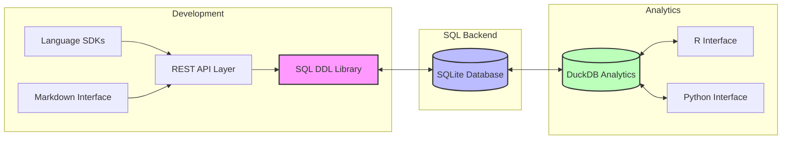
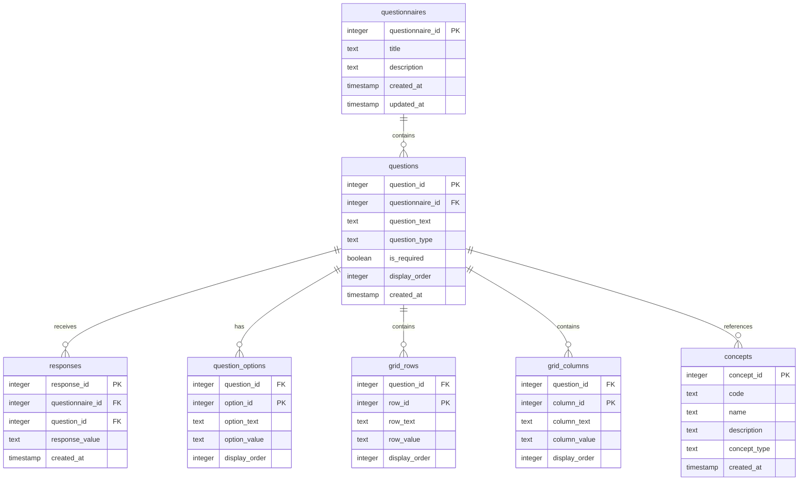
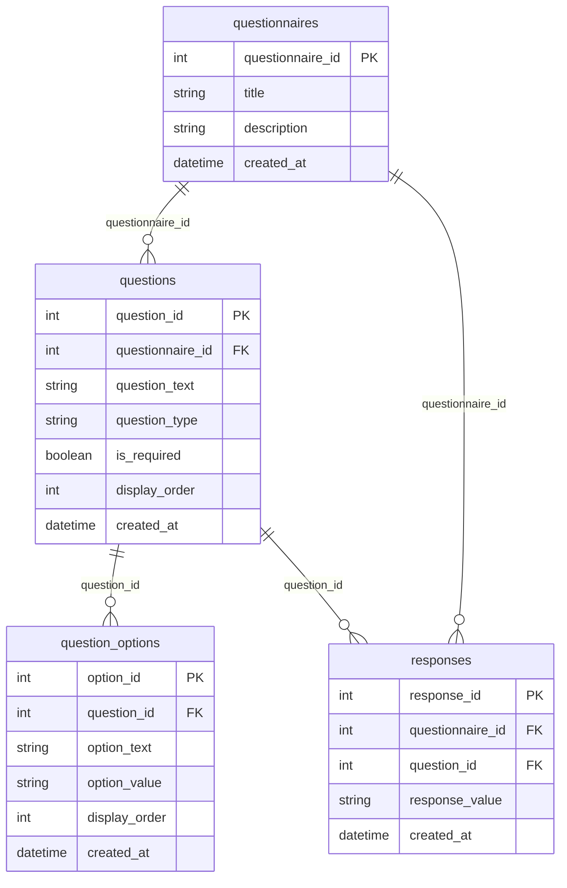
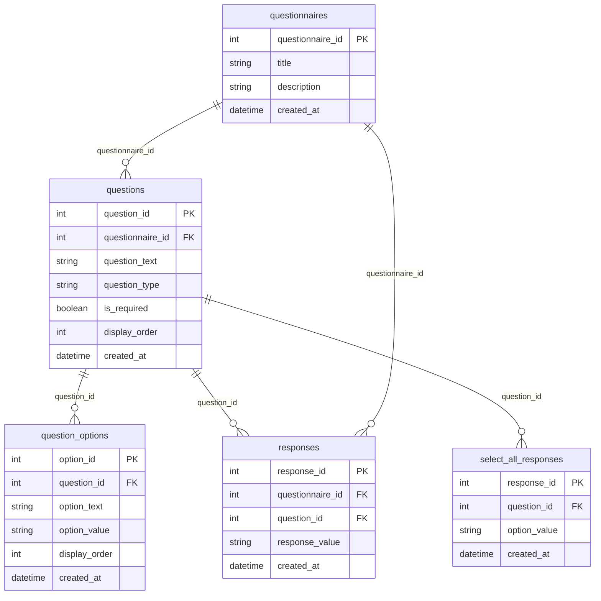
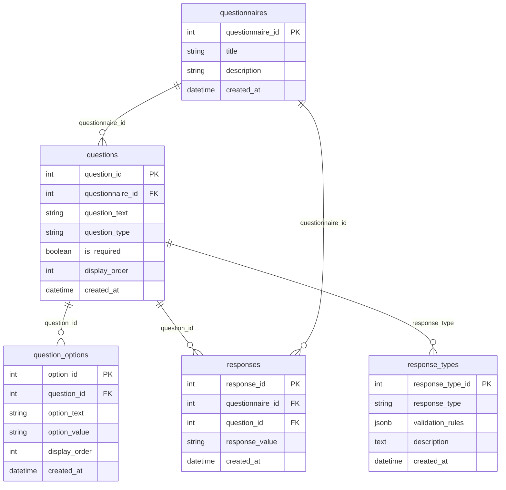
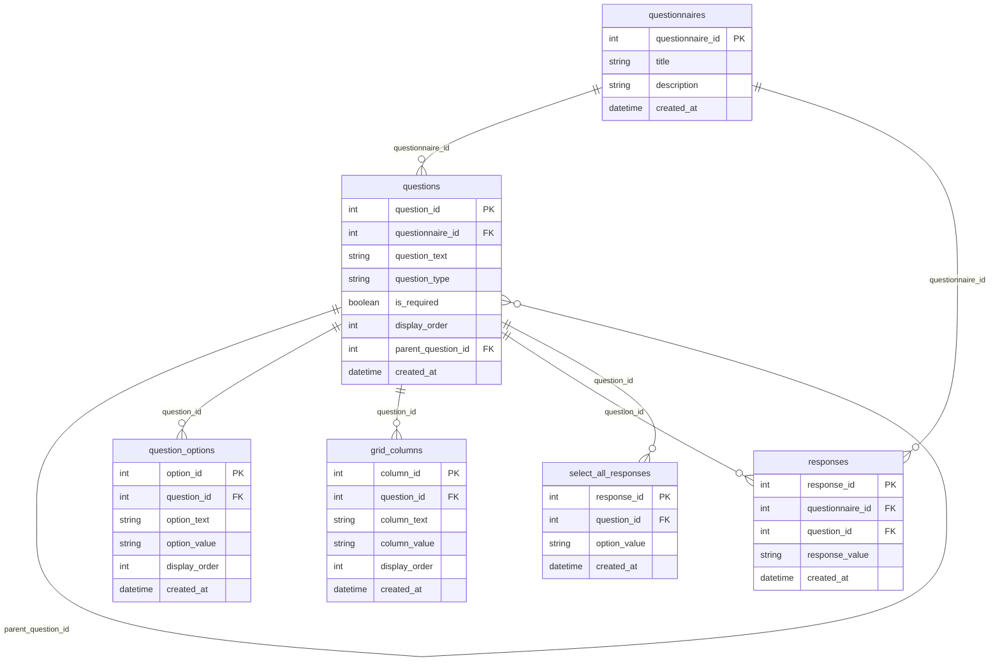
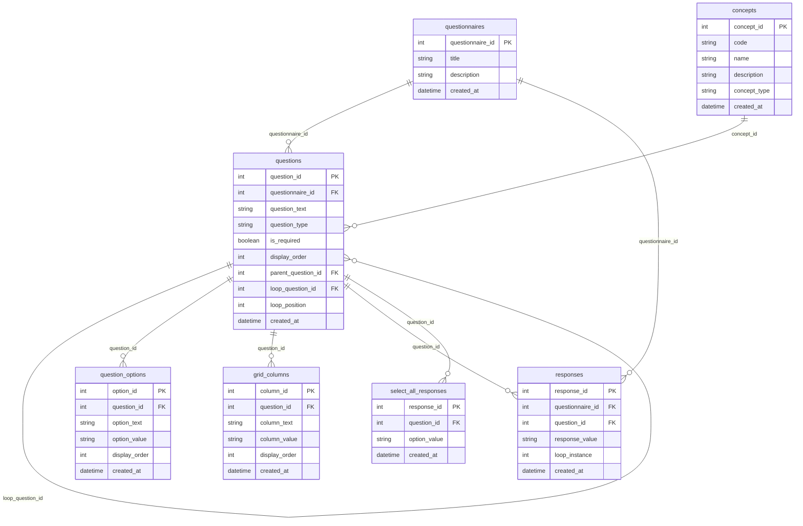

# QuestSQL

A SQL-first questionnaire development and administration system that unifies questionnaire design, data collection, and analysis through a single, well-structured data model. By making the data model itself self-documenting, QuestSQL eliminates the need for separate data dictionaries and ensures documentation is always in sync with the data.

## Table of Contents
- [Vision](#vision)
- [System Architecture](#system-architecture)
- [Core Data Model](#core-data-model)
- [Progressive Implementation](#progressive-implementation)
  - [Basic Model](#1-basic-model)
  - [Question Types](#2-question-types)
  - [Response Validation](#3-response-validation)
  - [Grid-based Questions](#4-grid-based-questions)
  - [Standardized Medical Concepts](#5-standardized-medical-concepts)
- [Example Health Questionnaire DDL](#example-health-questionnaire-ddl)
- [Complete Questionnaire Example](#complete-questionnaire-example)
- [OMOP Vocabulary Mapping](#omop-vocabulary-mapping)
- [Self-Documenting Data Model](#self-documenting-data-model)
- [ID Management and Uniqueness](#id-management-and-uniqueness)

## Vision

QuestSQL aims to revolutionize how health questionnaires are developed, administered, and analyzed by making SQL the foundation of everything. This approach provides several key benefits:

### SQL-First Design
- All questionnaire logic and relationships are encoded directly in SQL
- Questionnaire development happens through SQL DDL statements
- Enables multiple layers of abstraction:
  - REST APIs for DDL operations
  - SDKs for simplified interaction
  - Human-readable markdown language for questionnaire authoring

### Unified Data Model
- Single source of truth for questionnaire structure and data
- Eliminates the need for separate data dictionaries
- Enforces data quality and consistency through database constraints
- Supports both questionnaire development and data collection

### Client-Side Administration
- Lightweight SQLite-based UI for survey administration
- Direct interaction with the data model
- Real-time response collection and storage
- No complex middleware required

### Analytics Toolkit
- DuckDB-powered analysis capabilities
- Support for arbitrary questionnaire analysis
- Extensible API for community contributions
- SDKs for R, Python, and other languages

## System Architecture



The pipeline shows how QuestSQL integrates different components:

1. **Development Layer**
   - SQL DDL Library as the primary development tool
   - REST API as the central interface layer, using DDL for database operations
   - Language SDKs and Markdown interface connect through the API
   - All database operations go through the DDL layer

2. **SQL Backend**
   - SQLite database as the core storage
   - Direct interaction with DDL Library
   - Bidirectional data flow with analytics

3. **Analytics Layer**
   - DuckDB as the core analytics engine
   - Direct interfaces for R and Python
   - Bidirectional data flow with SQLite

## Core Data Model

The foundation of QuestSQL is its core data model, which consists of four essential tables:



This core model supports:
1. Basic questionnaire structure
2. Multiple question types
3. Response collection
4. Grid-based questions
5. Standardized medical concepts

## Progressive Implementation

QuestSQL is built incrementally, starting with a basic model and progressively adding more complex features. This approach allows for:
- Early testing of core functionality
- Gradual feature addition
- Continuous validation
- Clear development path

### 1. Basic Model

The simplest implementation supports three core question types: true/false, multiple choice, and text.



#### Basic Schema
```sql
CREATE TABLE questionnaires (
    questionnaire_id INTEGER PRIMARY KEY,
    title TEXT NOT NULL,
    description TEXT,
    created_at TIMESTAMP DEFAULT CURRENT_TIMESTAMP
);

CREATE TABLE questions (
    question_id INTEGER PRIMARY KEY,
    questionnaire_id INTEGER REFERENCES questionnaires(questionnaire_id),
    question_text TEXT NOT NULL,
    question_type TEXT NOT NULL CHECK (question_type IN ('true_false', 'multiple_choice', 'text')),
    is_required BOOLEAN DEFAULT false,
    display_order INTEGER NOT NULL,
    created_at TIMESTAMP DEFAULT CURRENT_TIMESTAMP
);

CREATE TABLE question_options (
    option_id INTEGER PRIMARY KEY,
    question_id INTEGER REFERENCES questions(question_id),
    option_text TEXT NOT NULL,
    option_value TEXT NOT NULL,
    display_order INTEGER NOT NULL,
    created_at TIMESTAMP DEFAULT CURRENT_TIMESTAMP
);

CREATE TABLE responses (
    response_id INTEGER PRIMARY KEY,
    questionnaire_id INTEGER REFERENCES questionnaires(questionnaire_id),
    question_id INTEGER REFERENCES questions(question_id),
    response_value TEXT NOT NULL,
    created_at TIMESTAMP DEFAULT CURRENT_TIMESTAMP
);
```

### 2. Question Types

The next level adds support for additional question types.



#### Extended Schema
```sql
-- Add select-all responses table
CREATE TABLE select_all_responses (
    response_id INTEGER PRIMARY KEY,
    question_id INTEGER REFERENCES questions(question_id),
    option_value TEXT NOT NULL,
    created_at TIMESTAMP DEFAULT CURRENT_TIMESTAMP
);

-- Update question type constraint
ALTER TABLE questions
    DROP CONSTRAINT valid_question_type;

ALTER TABLE questions
    ADD CONSTRAINT valid_question_type
    CHECK (question_type IN (
        'true_false',
        'multiple_choice',
        'select_all',
        'text'
    ));
```

### 3. Response Validation

The next level adds support for response validation.



#### Extended Schema
```sql
-- Add response types table
CREATE TABLE response_types (
    response_type_id INTEGER PRIMARY KEY,
    response_type TEXT NOT NULL UNIQUE,
    validation_rules JSONB NOT NULL,
    description TEXT,
    created_at TIMESTAMP DEFAULT CURRENT_TIMESTAMP
);

-- Link questions to response types
ALTER TABLE questions
    ADD COLUMN response_type_id INTEGER REFERENCES response_types(response_type_id);
```

### 4. Grid-based Questions

The next level adds support for grid questions with rows and columns.



#### Extended Schema
```sql
-- Add grid columns table
CREATE TABLE grid_columns (
    column_id INTEGER PRIMARY KEY,
    question_id INTEGER REFERENCES questions(question_id),
    column_text TEXT NOT NULL,
    column_value TEXT NOT NULL,
    display_order INTEGER NOT NULL,
    created_at TIMESTAMP DEFAULT CURRENT_TIMESTAMP
);

-- Update question type constraint
ALTER TABLE questions
    DROP CONSTRAINT valid_question_type;

ALTER TABLE questions
    ADD CONSTRAINT valid_question_type
    CHECK (question_type IN (
        'true_false',
        'multiple_choice',
        'select_all',
        'grid',
        'grid_row',
        'text'
    ));
```

### 5. Standardized Medical Concepts

The final level adds support for standardized medical concepts.



#### Extended Schema
```sql
-- Add concepts table
CREATE TABLE concepts (
    concept_id INTEGER PRIMARY KEY,
    code TEXT UNIQUE NOT NULL,
    name TEXT NOT NULL,
    description TEXT,
    concept_type TEXT NOT NULL,
    created_at TIMESTAMP DEFAULT CURRENT_TIMESTAMP
);

-- Link questions to concepts
ALTER TABLE questions
    ADD COLUMN concept_id INTEGER REFERENCES concepts(concept_id);
```

## Example Health Questionnaire DDL

Here are examples of how to create common health questionnaire question types using QuestSQL's DDL:

### 1. Numeric Scale Questions
```sql
-- Create a numeric scale question (e.g., pain scale 0-10)
CREATE TABLE numeric_scale_questions (
    question_id INTEGER PRIMARY KEY REFERENCES questions(question_id),
    min_value INTEGER NOT NULL,
    max_value INTEGER NOT NULL,
    step_size INTEGER DEFAULT 1,
    left_label TEXT,
    right_label TEXT,
    CONSTRAINT valid_scale CHECK (
        min_value < max_value AND
        step_size > 0 AND
        (max_value - min_value) % step_size = 0
    )
);

-- Example: Pain intensity scale
INSERT INTO questions (questionnaire_id, question_text, question_type, is_required, display_order)
VALUES (1, 'How would you rate your pain on a scale of 0 to 10?', 'numeric_scale', true, 1);

INSERT INTO numeric_scale_questions (question_id, min_value, max_value, left_label, right_label)
VALUES (last_insert_rowid(), 0, 10, 'No pain', 'Worst pain possible');
```

### 2. Multiple Choice with "Other" Option
```sql
-- Create a multiple choice question with "Other" option
CREATE TABLE multiple_choice_questions (
    question_id INTEGER PRIMARY KEY REFERENCES questions(question_id),
    allow_other BOOLEAN DEFAULT false,
    other_label TEXT DEFAULT 'Other (please specify)',
    max_selections INTEGER DEFAULT 1,
    CONSTRAINT valid_selections CHECK (max_selections > 0)
);

-- Example: Primary symptoms
INSERT INTO questions (questionnaire_id, question_text, question_type, is_required, display_order)
VALUES (1, 'Which symptoms are you experiencing? (Select all that apply)', 'multiple_choice', true, 2);

INSERT INTO multiple_choice_questions (question_id, allow_other, max_selections)
VALUES (last_insert_rowid(), true, 10);

-- Add options
INSERT INTO question_options (question_id, option_text, option_value, display_order)
VALUES 
    (last_insert_rowid(), 'Headache', 'headache', 1),
    (last_insert_rowid(), 'Nausea', 'nausea', 2),
    (last_insert_rowid(), 'Fatigue', 'fatigue', 3),
    (last_insert_rowid(), 'Other (please specify)', 'other', 4);
```

### 3. Grid Questions for Related Items
```sql
-- Create a grid question (e.g., symptom severity matrix)
CREATE TABLE grid_questions (
    question_id INTEGER PRIMARY KEY REFERENCES questions(question_id),
    row_type TEXT NOT NULL,
    column_type TEXT NOT NULL,
    allow_skip BOOLEAN DEFAULT false
);

-- Example: Symptom severity and frequency grid
INSERT INTO questions (questionnaire_id, question_text, question_type, is_required, display_order)
VALUES (1, 'Please rate the severity and frequency of your symptoms', 'grid', true, 3);

INSERT INTO grid_questions (question_id, row_type, column_type)
VALUES (last_insert_rowid(), 'symptom', 'rating');

-- Add rows (symptoms)
INSERT INTO grid_rows (question_id, row_text, row_value, display_order)
VALUES 
    (last_insert_rowid(), 'Headache', 'headache', 1),
    (last_insert_rowid(), 'Nausea', 'nausea', 2),
    (last_insert_rowid(), 'Fatigue', 'fatigue', 3);

-- Add columns (rating scale)
INSERT INTO grid_columns (question_id, column_text, column_value, display_order)
VALUES 
    (last_insert_rowid(), 'None', '0', 1),
    (last_insert_rowid(), 'Mild', '1', 2),
    (last_insert_rowid(), 'Moderate', '2', 3),
    (last_insert_rowid(), 'Severe', '3', 4);
```

### 4. Date/Time Questions
```sql
-- Create a date/time question
CREATE TABLE datetime_questions (
    question_id INTEGER PRIMARY KEY REFERENCES questions(question_id),
    date_format TEXT NOT NULL,
    allow_time BOOLEAN DEFAULT false,
    min_date DATE,
    max_date DATE,
    CONSTRAINT valid_date_format CHECK (
        date_format IN ('YYYY-MM-DD', 'MM/DD/YYYY', 'DD/MM/YYYY')
    )
);

-- Example: Last medication taken
INSERT INTO questions (questionnaire_id, question_text, question_type, is_required, display_order)
VALUES (1, 'When did you last take your medication?', 'datetime', true, 4);

INSERT INTO datetime_questions (question_id, date_format, allow_time, min_date)
VALUES (last_insert_rowid(), 'YYYY-MM-DD', true, date('now', '-30 days'));
```

### 5. Conditional Questions
```sql
-- Create a conditional question
CREATE TABLE conditional_questions (
    question_id INTEGER PRIMARY KEY REFERENCES questions(question_id),
    parent_question_id INTEGER REFERENCES questions(question_id),
    condition_type TEXT NOT NULL,
    condition_value TEXT NOT NULL,
    CONSTRAINT valid_condition CHECK (
        condition_type IN ('equals', 'not_equals', 'greater_than', 'less_than')
    )
);

-- Example: Follow-up question based on previous response
INSERT INTO questions (questionnaire_id, question_text, question_type, is_required, display_order)
VALUES (1, 'Have you experienced any side effects?', 'true_false', true, 5);

INSERT INTO questions (questionnaire_id, question_text, question_type, is_required, display_order)
VALUES (1, 'Please describe the side effects:', 'text', false, 6);

INSERT INTO conditional_questions (question_id, parent_question_id, condition_type, condition_value)
VALUES (last_insert_rowid(), last_insert_rowid() - 1, 'equals', 'true');
```

### 6. File Upload Questions
```sql
-- Create a file upload question
CREATE TABLE file_upload_questions (
    question_id INTEGER PRIMARY KEY REFERENCES questions(question_id),
    allowed_types TEXT[] NOT NULL,
    max_size_mb INTEGER NOT NULL,
    max_files INTEGER DEFAULT 1,
    CONSTRAINT valid_file_config CHECK (
        max_size_mb > 0 AND max_files > 0
    )
);

-- Example: Upload medical records
INSERT INTO questions (questionnaire_id, question_text, question_type, is_required, display_order)
VALUES (1, 'Please upload any relevant medical records', 'file_upload', false, 7);

INSERT INTO file_upload_questions (question_id, allowed_types, max_size_mb, max_files)
VALUES (last_insert_rowid(), ARRAY['pdf', 'jpg', 'png'], 10, 3);
```

These examples demonstrate how QuestSQL's DDL can handle various types of health questionnaire questions while maintaining data integrity and validation. Each question type includes:
- Appropriate constraints for data validation
- Support for required/optional questions
- Display order management
- Integration with the core questions table
- Support for conditional logic where needed

## Complete Questionnaire Example

This section demonstrates how to create a complete 10-question health questionnaire using QuestSQL's DDL. We'll create a "Patient Health Assessment" questionnaire that includes various question types.

### Setting Up ID Management
```sql
-- First, ensure we have our ID sequence
CREATE SEQUENCE IF NOT EXISTS questionnaire_id_seq
    START WITH 1
    INCREMENT BY 1
    NO MINVALUE
    NO MAXVALUE
    CACHE 1;

-- Create a function to get the next questionnaire ID
CREATE OR REPLACE FUNCTION get_next_questionnaire_id()
RETURNS INTEGER AS $$
BEGIN
    RETURN nextval('questionnaire_id_seq');
END;
$$ LANGUAGE plpgsql;
```

### Creating the Questionnaire
```sql
-- Create the questionnaire with a unique ID
INSERT INTO questionnaires (questionnaire_id, title, description)
VALUES (
    get_next_questionnaire_id(),
    'Patient Health Assessment',
    'A comprehensive health assessment questionnaire covering various aspects of patient health and well-being'
);

-- Store the questionnaire ID for later use
DO $$
DECLARE
    v_questionnaire_id INTEGER;
BEGIN
    -- Get the current questionnaire ID
    SELECT questionnaire_id INTO v_questionnaire_id
    FROM questionnaires
    WHERE title = 'Patient Health Assessment'
    ORDER BY created_at DESC
    LIMIT 1;

    -- Ensure we have a valid questionnaire ID
    IF v_questionnaire_id IS NULL THEN
        RAISE EXCEPTION 'Failed to create questionnaire';
    END IF;
```

### 1. Basic Information Questions
```sql
    -- Question 1: Patient Name
    INSERT INTO questions (questionnaire_id, question_text, question_type, is_required, display_order)
    VALUES (v_questionnaire_id, 'What is your full name?', 'text', true, 1)
    RETURNING question_id INTO v_question_id;

    -- Question 2: Date of Birth
    INSERT INTO questions (questionnaire_id, question_text, question_type, is_required, display_order)
    VALUES (v_questionnaire_id, 'What is your date of birth?', 'datetime', true, 2)
    RETURNING question_id INTO v_question_id;

    -- Add datetime configuration with uniqueness check
    INSERT INTO datetime_questions (question_id, date_format, allow_time, min_date)
    VALUES (v_question_id, 'YYYY-MM-DD', false, date('1900-01-01'))
    ON CONFLICT (question_id) DO UPDATE
    SET date_format = EXCLUDED.date_format,
        allow_time = EXCLUDED.allow_time,
        min_date = EXCLUDED.min_date;
```

### 2. Health Status Questions
```sql
    -- Question 3: Overall Health Rating
    INSERT INTO questions (questionnaire_id, question_text, question_type, is_required, display_order)
    VALUES (v_questionnaire_id, 'How would you rate your overall health?', 'numeric_scale', true, 3)
    RETURNING question_id INTO v_question_id;

    -- Add numeric scale configuration with uniqueness check
    INSERT INTO numeric_scale_questions (question_id, min_value, max_value, left_label, right_label)
    VALUES (v_question_id, 1, 5, 'Poor', 'Excellent')
    ON CONFLICT (question_id) DO UPDATE
    SET min_value = EXCLUDED.min_value,
        max_value = EXCLUDED.max_value,
        left_label = EXCLUDED.left_label,
        right_label = EXCLUDED.right_label;

    -- Question 4: Primary Health Concerns
    INSERT INTO questions (questionnaire_id, question_text, question_type, is_required, display_order)
    VALUES (v_questionnaire_id, 'What are your primary health concerns? (Select all that apply)', 'multiple_choice', true, 4)
    RETURNING question_id INTO v_question_id;

    -- Add multiple choice configuration with uniqueness check
    INSERT INTO multiple_choice_questions (question_id, allow_other, max_selections)
    VALUES (v_question_id, true, 5)
    ON CONFLICT (question_id) DO UPDATE
    SET allow_other = EXCLUDED.allow_other,
        max_selections = EXCLUDED.max_selections;

    -- Add options with uniqueness check
    INSERT INTO question_options (question_id, option_text, option_value, display_order)
    VALUES 
        (v_question_id, 'Chronic Pain', 'chronic_pain', 1),
        (v_question_id, 'Anxiety/Depression', 'anxiety_depression', 2),
        (v_question_id, 'Sleep Issues', 'sleep_issues', 3),
        (v_question_id, 'Digestive Problems', 'digestive_problems', 4),
        (v_question_id, 'Other (please specify)', 'other', 5)
    ON CONFLICT (question_id, option_value) DO UPDATE
    SET option_text = EXCLUDED.option_text,
        display_order = EXCLUDED.display_order;
```

### 3. Symptom Assessment
```sql
    -- Question 5: Symptom Severity Grid
    INSERT INTO questions (questionnaire_id, question_text, question_type, is_required, display_order)
    VALUES (v_questionnaire_id, 'Please rate the severity of your symptoms', 'grid', true, 5)
    RETURNING question_id INTO v_question_id;

    -- Add grid configuration with uniqueness check
    INSERT INTO grid_questions (question_id, row_type, column_type)
    VALUES (v_question_id, 'symptom', 'severity')
    ON CONFLICT (question_id) DO UPDATE
    SET row_type = EXCLUDED.row_type,
        column_type = EXCLUDED.column_type;

    -- Add symptoms as rows with uniqueness check
    INSERT INTO grid_rows (question_id, row_text, row_value, display_order)
    VALUES 
        (v_question_id, 'Pain', 'pain', 1),
        (v_question_id, 'Fatigue', 'fatigue', 2),
        (v_question_id, 'Anxiety', 'anxiety', 3),
        (v_question_id, 'Sleep Quality', 'sleep', 4)
    ON CONFLICT (question_id, row_value) DO UPDATE
    SET row_text = EXCLUDED.row_text,
        display_order = EXCLUDED.display_order;

    -- Add severity scale as columns with uniqueness check
    INSERT INTO grid_columns (question_id, column_text, column_value, display_order)
    VALUES 
        (v_question_id, 'None', '0', 1),
        (v_question_id, 'Mild', '1', 2),
        (v_question_id, 'Moderate', '2', 3),
        (v_question_id, 'Severe', '3', 4)
    ON CONFLICT (question_id, column_value) DO UPDATE
    SET column_text = EXCLUDED.column_text,
        display_order = EXCLUDED.display_order;
```

### 4. Medication and Treatment
```sql
    -- Question 6: Current Medications
    INSERT INTO questions (questionnaire_id, question_text, question_type, is_required, display_order)
    VALUES (v_questionnaire_id, 'Are you currently taking any medications?', 'true_false', true, 6)
    RETURNING question_id INTO v_question_id;

    -- Question 7: Medication Details (Conditional)
    INSERT INTO questions (questionnaire_id, question_text, question_type, is_required, display_order)
    VALUES (v_questionnaire_id, 'Please list your current medications:', 'text', false, 7)
    RETURNING question_id INTO v_question_id;

    -- Add conditional logic with uniqueness check
    INSERT INTO conditional_questions (question_id, parent_question_id, condition_type, condition_value)
    VALUES (v_question_id, v_question_id - 1, 'equals', 'true')
    ON CONFLICT (question_id) DO UPDATE
    SET parent_question_id = EXCLUDED.parent_question_id,
        condition_type = EXCLUDED.condition_type,
        condition_value = EXCLUDED.condition_value;
```

### 5. Lifestyle and Habits
```sql
    -- Question 8: Exercise Frequency
    INSERT INTO questions (questionnaire_id, question_text, question_type, is_required, display_order)
    VALUES (v_questionnaire_id, 'How often do you exercise?', 'multiple_choice', true, 8)
    RETURNING question_id INTO v_question_id;

    -- Add options with uniqueness check
    INSERT INTO question_options (question_id, option_text, option_value, display_order)
    VALUES 
        (v_question_id, 'Never', 'never', 1),
        (v_question_id, '1-2 times per week', '1_2', 2),
        (v_question_id, '3-4 times per week', '3_4', 3),
        (v_question_id, '5 or more times per week', '5_plus', 4)
    ON CONFLICT (question_id, option_value) DO UPDATE
    SET option_text = EXCLUDED.option_text,
        display_order = EXCLUDED.display_order;
```

### 6. Quality of Life
```sql
    -- Question 9: Quality of Life Impact
    INSERT INTO questions (questionnaire_id, question_text, question_type, is_required, display_order)
    VALUES (v_questionnaire_id, 'How has your health condition affected your quality of life?', 'numeric_scale', true, 9)
    RETURNING question_id INTO v_question_id;

    -- Add numeric scale configuration with uniqueness check
    INSERT INTO numeric_scale_questions (question_id, min_value, max_value, left_label, right_label)
    VALUES (v_question_id, 1, 10, 'Not at all', 'Significantly')
    ON CONFLICT (question_id) DO UPDATE
    SET min_value = EXCLUDED.min_value,
        max_value = EXCLUDED.max_value,
        left_label = EXCLUDED.left_label,
        right_label = EXCLUDED.right_label;
```

### 7. Additional Information
```sql
    -- Question 10: Additional Notes
    INSERT INTO questions (questionnaire_id, question_text, question_type, is_required, display_order)
    VALUES (v_questionnaire_id, 'Is there anything else you would like to share about your health?', 'text', false, 10)
    RETURNING question_id INTO v_question_id;

END $$;
```

### Verifying Questionnaire Structure
```sql
-- Verify questionnaire creation
SELECT 
    q.questionnaire_id,
    q.title,
    COUNT(DISTINCT q.question_id) as total_questions,
    COUNT(DISTINCT CASE WHEN q.is_required THEN q.question_id END) as required_questions
FROM questionnaires q
LEFT JOIN questions qs ON q.questionnaire_id = qs.questionnaire_id
WHERE q.title = 'Patient Health Assessment'
GROUP BY q.questionnaire_id, q.title;

-- Get all questions with their types and configurations
SELECT 
    q.display_order,
    q.question_text,
    q.question_type,
    q.is_required,
    CASE 
        WHEN q.question_type = 'numeric_scale' THEN 
            (SELECT CONCAT(min_value, ' to ', max_value, ' (', left_label, ' to ', right_label, ')')
             FROM numeric_scale_questions 
             WHERE question_id = q.question_id)
        WHEN q.question_type = 'multiple_choice' THEN 
            (SELECT GROUP_CONCAT(option_text)
             FROM question_options 
             WHERE question_id = q.question_id)
        WHEN q.question_type = 'grid' THEN 
            (SELECT CONCAT('Grid with ', COUNT(DISTINCT r.row_text), ' rows and ', 
                          COUNT(DISTINCT c.column_text), ' columns')
             FROM grid_questions g
             LEFT JOIN grid_rows r ON g.question_id = r.question_id
             LEFT JOIN grid_columns c ON g.question_id = c.question_id
             WHERE g.question_id = q.question_id)
        ELSE NULL
    END as configuration
FROM questions q
WHERE q.questionnaire_id = (SELECT questionnaire_id FROM questionnaires WHERE title = 'Patient Health Assessment')
ORDER BY q.display_order;
```

This example demonstrates:
1. Proper ID management using sequences
2. Uniqueness constraints with ON CONFLICT clauses
3. Transaction safety using DO blocks
4. Variable scoping for ID tracking
5. Verification queries for data integrity

The resulting questionnaire includes:
- Basic information (name, DOB)
- Health status assessment
- Symptom severity grid
- Medication information
- Lifestyle questions
- Quality of life assessment
- Open-ended feedback

## OMOP Vocabulary Mapping

QuestSQL supports mapping questionnaire responses to OMOP standard vocabularies through a simple mapping system:

### 1. OMOP Vocabulary Sources
```sql
-- Track OMOP vocabulary sources
CREATE TABLE vocabulary_sources (
    source_id INTEGER PRIMARY KEY DEFAULT get_next_id(),
    source_name TEXT NOT NULL UNIQUE,  -- e.g., 'SNOMED', 'RxNorm', 'ICD10'
    source_version TEXT NOT NULL,
    created_at TIMESTAMP DEFAULT CURRENT_TIMESTAMP
);

-- Example sources
INSERT INTO vocabulary_sources (source_name, source_version) VALUES
    ('SNOMED', '5.0'),
    ('RxNorm', '2023-12-01'),
    ('ICD10', '2023');
```

### 2. Response Mapping
```sql
-- Map responses to OMOP concepts
CREATE TABLE response_concept_mapping (
    mapping_id INTEGER PRIMARY KEY DEFAULT get_next_id(),
    question_id INTEGER REFERENCES questions(question_id),
    response_value TEXT NOT NULL,
    source_id INTEGER REFERENCES vocabulary_sources(source_id),
    concept_code TEXT NOT NULL,  -- OMOP concept code
    concept_name TEXT NOT NULL,  -- OMOP concept name
    created_at TIMESTAMP DEFAULT CURRENT_TIMESTAMP,
    -- Ensure unique mappings per response
    UNIQUE(question_id, response_value, source_id, concept_code)
);

-- Example mappings
INSERT INTO response_concept_mapping 
    (question_id, response_value, source_id, concept_code, concept_name) 
VALUES
    -- Map "Yes" response to diabetes diagnosis in SNOMED
    (1, 'Yes', 1, '73211009', 'Diabetes mellitus'),
    -- Map "Metformin" response to RxNorm drug
    (2, 'Metformin', 2, '6809', 'metformin');
```

### 3. Querying Mapped Data
```sql
-- View for analyzing mapped responses
CREATE VIEW mapped_responses AS
SELECT 
    r.response_id,
    q.question_text,
    r.response_value,
    rc.concept_code,
    rc.concept_name,
    vs.source_name
FROM responses r
JOIN questions q ON r.question_id = q.question_id
LEFT JOIN response_concept_mapping rc ON 
    r.question_id = rc.question_id AND 
    r.response_value = rc.response_value
LEFT JOIN vocabulary_sources vs ON rc.source_id = vs.source_id;

-- Example query: Get all medication responses mapped to RxNorm
SELECT 
    question_text,
    response_value,
    concept_code,
    concept_name
FROM mapped_responses
WHERE source_name = 'RxNorm'
ORDER BY question_text;
```

This mapping system provides:
1. Support for OMOP standard vocabularies
2. Simple one-to-one response mapping
3. Easy querying of mapped data
4. Minimal additional complexity

## Self-Documenting Data Model

QuestSQL's data model serves as a self-documenting data dictionary, eliminating the need for separate documentation. This is achieved through several key features:

### 1. Explicit Structure
- Table and column names clearly describe their purpose
- Foreign key relationships define data dependencies
- Constraints enforce data rules and validations
- Comments and descriptions are stored in the database

```sql
-- Example of self-documenting table structure
CREATE TABLE questions (
    question_id INTEGER PRIMARY KEY,
    questionnaire_id INTEGER REFERENCES questionnaires(questionnaire_id),
    question_text TEXT NOT NULL,
    question_type TEXT NOT NULL CHECK (question_type IN ('true_false', 'multiple_choice', 'text')),
    is_required BOOLEAN DEFAULT false,
    display_order INTEGER NOT NULL,
    created_at TIMESTAMP DEFAULT CURRENT_TIMESTAMP,
    -- Additional metadata can be added as needed
    description TEXT,
    help_text TEXT,
    validation_rules JSON
);

-- Add table and column comments
COMMENT ON TABLE questions IS 'Stores all questions in questionnaires with their properties and constraints';
COMMENT ON COLUMN questions.question_type IS 'Defines the type of question and its expected response format';
```

### 2. Standardized Concepts
- Medical concepts are stored in a dedicated table
- Each concept has a unique code and description
- Concepts can be referenced across questions
- Supports standardized terminology mapping

```sql
-- Example of concept mapping
CREATE TABLE concepts (
    concept_id INTEGER PRIMARY KEY,
    code TEXT UNIQUE NOT NULL,
    name TEXT NOT NULL,
    description TEXT,
    concept_type TEXT NOT NULL,
    created_at TIMESTAMP DEFAULT CURRENT_TIMESTAMP
);

-- Link questions to concepts
ALTER TABLE questions
    ADD COLUMN concept_id INTEGER REFERENCES concepts(concept_id);
```

### 3. Response Validation
- Response formats are enforced by constraints
- Question types define valid response values
- Validation rules are stored in the database
- Error messages are part of the schema

```sql
-- Example of response validation
CREATE TABLE responses (
    response_id INTEGER PRIMARY KEY,
    questionnaire_id INTEGER REFERENCES questionnaires(questionnaire_id),
    question_id INTEGER REFERENCES questions(question_id),
    response_value TEXT NOT NULL,
    created_at TIMESTAMP DEFAULT CURRENT_TIMESTAMP,
    -- Validation constraints
    CONSTRAINT valid_response CHECK (
        (SELECT question_type FROM questions WHERE question_id = responses.question_id) != 'true_false'
        OR response_value IN ('true', 'false')
    )
);
```

### 4. Queryable Metadata
- All structural information is queryable
- Relationships can be discovered through SQL
- Constraints and rules are accessible
- Documentation is always in sync with the data

```sql
-- Example queries for metadata
-- Get all questions with their concepts
SELECT 
    q.question_text,
    c.name as concept_name,
    c.description as concept_description
FROM questions q
LEFT JOIN concepts c ON q.concept_id = c.concept_id;

-- Get validation rules for a question
SELECT 
    q.question_text,
    q.validation_rules
FROM questions q
WHERE q.validation_rules IS NOT NULL;
```

### 5. Version Control
- Schema changes are tracked in SQL
- Migration scripts document evolution
- Historical changes are preserved
- Documentation stays current

```sql
-- Example of version tracking
CREATE TABLE schema_versions (
    version_id INTEGER PRIMARY KEY,
    version_number TEXT NOT NULL,
    applied_at TIMESTAMP DEFAULT CURRENT_TIMESTAMP,
    description TEXT,
    migration_script TEXT
);
```

This self-documenting approach ensures:
1. Single source of truth for data structure
2. Automatic synchronization of documentation and data
3. Queryable metadata for analysis
4. Standardized concept mapping
5. Enforced data quality rules

## ID Management and Uniqueness

QuestSQL enforces data quality through various constraints and validation rules:

[Previous validation section remains the same]