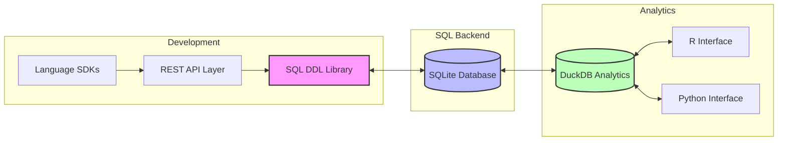
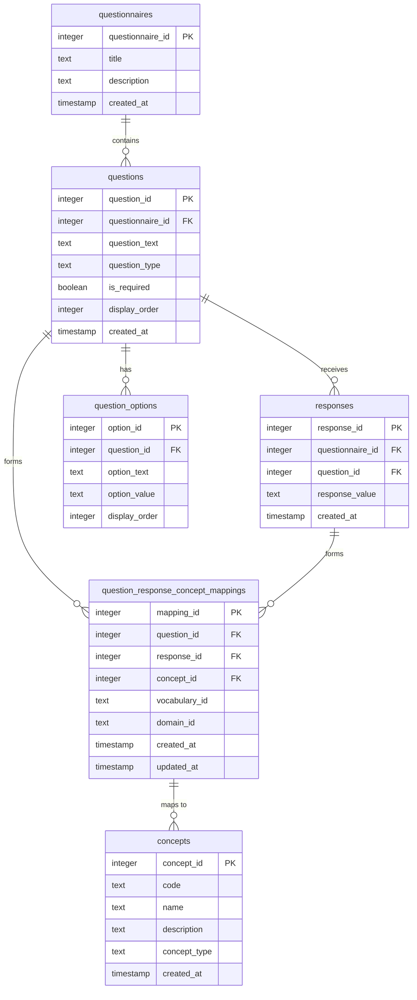
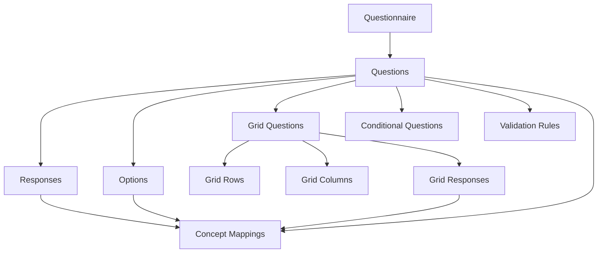

# QuestSQL

A SQL-first questionnaire development and administration system that unifies questionnaire design, data collection, and analysis through a single, well-structured data model. Built with OMOP CDM compatibility in mind, it enables seamless integration with clinical data systems.

## Table of Contents
1. [Overview](#overview)
2. [Architecture](#architecture)
3. [Core Data Model](#core-data-model)
4. [Clinical Concept Mapping](#clinical-concept-mapping)
5. [Progressive Implementation](#progressive-implementation)
6. [OMOP Integration](#omop-integration)
7. [Examples](#examples)
8. [Validation and Constraints](#validation-and-constraints)
9. [Analytics and Export](#analytics-and-export)

## Overview

QuestSQL provides a unified approach to health questionnaire development and administration:

- **SQL-First Design**: All questionnaire logic encoded directly in SQL
- **Concept Mapping**: Enforced mapping to clinical concepts during questionnaire development
- **OMOP Compatible**: Direct mapping to clinical concepts and vocabularies
- **Self-Documenting**: Schema serves as the data dictionary
- **Analytics Ready**: Built-in support for clinical data analysis

### Key Principles

1. **Development-Time Mapping**
   - Questions must map to standard clinical concepts during creation
   - Response options must map to standard clinical values
   - Question-response pairs must form valid clinical observations
   - All mappings are enforced through database constraints

2. **Vocabulary Standardization**
   - Uses standard clinical vocabularies (SNOMED, LOINC, RxNorm)
   - Maintains explicit vocabulary source tracking
   - Enables cross-vocabulary mapping
   - Supports OMOP CDM compatibility

3. **Data Quality**
   - Enforces standard concept usage
   - Validates against clinical vocabularies
   - Maintains data consistency
   - Supports quality checks

## Architecture

The system is built around three core components:



### Key Components
1. **Development Layer**
   - SQL DDL Library for schema management
   - REST API for remote operations
   - SDKs for language-specific integration

2. **SQL Backend**
   - SQLite for local data storage
   - Direct DDL interaction
   - Real-time data collection

3. **Analytics Layer**
   - DuckDB for high-performance analysis
   - R and Python interfaces
   - Extensible analytics toolkit

## Core Data Model

The foundation of QuestSQL is its concept-mapped data model, with question-response pairs as the fundamental mappable unit:



### Key Features
- Question-response pairs are the fundamental mappable unit
- Each pair maps to a complete clinical observation
- Questions map to standard clinical concepts (e.g., "Blood Pressure" maps to concept_id 3004249)
- Responses map to standard clinical values (e.g., "High" maps to concept_id 4171373)
- Question-response pairs map to complete clinical observations (e.g., "High Blood Pressure" maps to concept_id 4171373)
- Question options map to standard values (e.g., "Yes" maps to concept_id 4188539)
- Built-in support for multiple question types
- Standardized value sets through concept mapping
- Temporal data tracking
- Explicit vocabulary tracking (SNOMED, RxNorm, etc.)

## Storage Approaches

QuestSQL could have chosen either a normalized or denormalized approach for storing structured data. While both approaches have their merits, QuestSQL implements a normalized approach for the following reasons:

### Normalized Approach (QuestSQL's Choice)
- Uses traditional relational tables with proper foreign key relationships
- Better for data integrity, querying, and maintaining relationships
- Example: Grid questions use separate tables for rows and columns
```sql
CREATE TABLE grid_rows (
    row_id INTEGER PRIMARY KEY,
    grid_id INTEGER,
    row_text TEXT,
    order_index INTEGER,
    FOREIGN KEY (grid_id) REFERENCES grid_questions(grid_id)
);
```

### Denormalized Approach (Not Implemented)
- Stores structured data as JSON in TEXT fields
- Simpler schema but less flexible for querying
- Example: Grid questions using JSON arrays
```sql
CREATE TABLE grid_questions (
    grid_id INTEGER PRIMARY KEY,
    rows TEXT,  -- '["Headache", "Fatigue", "Nausea"]'
    columns TEXT  -- '["Never", "Sometimes", "Often", "Always"]'
);
```

### Why QuestSQL Chooses Normalization

1. **Data Integrity**
   - Enforces referential integrity through foreign keys
   - Prevents orphaned or invalid data
   - Maintains data consistency across tables

2. **Query Flexibility**
   - Enables complex queries and joins
   - Supports efficient filtering and aggregation
   - Allows for better performance optimization

3. **OMOP CDM Compatibility**
   - Aligns with OMOP's normalized structure
   - Makes mapping to OMOP concepts more straightforward
   - Supports better integration with clinical systems

4. **Maintainability**
   - Easier to modify individual components
   - Better support for data migrations
   - Clearer data relationships

## Data Dictionary View

QuestSQL provides a comprehensive `data_dictionary` view that denormalizes all question metadata into a human-readable format. This view combines information from multiple tables into a single, queryable view that makes it easy to understand the structure and relationships of questionnaire data.

The view includes:
1. **Questionnaire Information**: Title, version, status, and description
2. **Question Information**: Text, type, required flag, and order
3. **Question Options**: For multiple choice questions, including text, value, and order
4. **Grid Question Structure**: Grid type and structure (rows and columns)
5. **Conditional Logic**: Parent question relationships and display rules
6. **Validation Rules**: Rule type, value, and error message
7. **Concept Mappings**: Both question and response concept mappings with vocabulary and domain information
8. **Response Statistics**: Response count, first and last response dates
9. **Metadata**: Creation and update timestamps

Example queries using the data dictionary view:
```sql
-- Get all questions in a questionnaire
SELECT * FROM data_dictionary WHERE questionnaire_id = 1;

-- Get all grid questions
SELECT * FROM data_dictionary WHERE question_type = 'grid';

-- Get questions with specific concept mappings
SELECT * FROM data_dictionary WHERE question_concept_mappings LIKE '%3004249%';

-- Get questions with validation rules
SELECT * FROM data_dictionary WHERE validation_rules IS NOT NULL;

-- Get questions with conditional logic
SELECT * FROM data_dictionary WHERE conditional_logic IS NOT NULL;
```

### Example Data Dictionary View

The following table shows example data from the data dictionary view with realistic questionnaire data:

| questionnaire_id | questionnaire_title | question_id | question_text | question_type | required | question_order | question_options | grid_structure | conditional_logic | validation_rules | question_concept_mappings | response_concept_mappings | response_count | first_response_date | last_response_date |
|-----------------|-------------------|-------------|---------------|---------------|-----------|----------------|------------------|----------------|-------------------|------------------|------------------------|-------------------------|----------------|-------------------|------------------|
| 1 | Health Assessment | 1 | What is your blood pressure? | grid | true | 1 | null | {"grid_type": "measurement", "rows": [{"row_text": "Systolic", "order_index": 1}, {"row_text": "Diastolic", "order_index": 2}], "columns": [{"column_text": "Normal", "order_index": 1}, {"column_text": "High", "order_index": 2}, {"column_text": "Low", "order_index": 3}]} | null | [{"rule_type": "range", "rule_value": "90-140", "error_message": "Systolic must be between 90 and 140"}] | [{"concept_id": 3004249, "vocabulary_id": "SNOMED", "domain_id": "Measurement", "mapping_type": "question"}] | [{"concept_id": 4171373, "vocabulary_id": "SNOMED", "domain_id": "Measurement", "mapping_type": "response"}] | 150 | 2024-01-01 | 2024-03-15 |
| 1 | Health Assessment | 2 | Are you experiencing any of these symptoms? | select_all | true | 2 | [{"option_text": "Headache", "option_value": "headache", "order_index": 1}, {"option_text": "Fatigue", "option_value": "fatigue", "order_index": 2}, {"option_text": "Nausea", "option_value": "nausea", "order_index": 3}] | null | null | null | [{"concept_id": 36714913, "vocabulary_id": "SNOMED", "domain_id": "Condition", "mapping_type": "question"}] | [{"concept_id": 36714913, "vocabulary_id": "SNOMED", "domain_id": "Condition", "mapping_type": "response"}] | 145 | 2024-01-01 | 2024-03-15 |
| 1 | Health Assessment | 3 | How often do you exercise? | multiple_choice | false | 3 | [{"option_text": "Never", "option_value": "never", "order_index": 1}, {"option_text": "1-2 times/week", "option_value": "1-2", "order_index": 2}, {"option_text": "3-4 times/week", "option_value": "3-4", "order_index": 3}, {"option_text": "5+ times/week", "option_value": "5+", "order_index": 4}] | null | {"parent_question_id": 2, "parent_response_value": "fatigue", "display_order": 1} | null | [{"concept_id": 40491925, "vocabulary_id": "SNOMED", "domain_id": "Observation", "mapping_type": "question"}] | [{"concept_id": 40491925, "vocabulary_id": "SNOMED", "domain_id": "Observation", "mapping_type": "response"}] | 120 | 2024-01-01 | 2024-03-15 |
| 1 | Health Assessment | 4 | Rate your pain level | grid | true | 4 | null | {"grid_type": "rating", "rows": [{"row_text": "Current Pain", "order_index": 1}, {"row_text": "Average Pain", "order_index": 2}], "columns": [{"column_text": "None", "order_index": 1}, {"column_text": "Mild", "order_index": 2}, {"column_text": "Moderate", "order_index": 3}, {"column_text": "Severe", "order_index": 4}]} | null | [{"rule_type": "required", "rule_value": "true", "error_message": "Pain level must be specified"}] | [{"concept_id": 36714913, "vocabulary_id": "SNOMED", "domain_id": "Condition", "mapping_type": "question"}] | [{"concept_id": 36714913, "vocabulary_id": "SNOMED", "domain_id": "Condition", "mapping_type": "response"}] | 140 | 2024-01-01 | 2024-03-15 |
| 1 | Health Assessment | 5 | Are you currently taking any medications? | true_false | true | 5 | null | null | null | null | [{"concept_id": 4023213, "vocabulary_id": "SNOMED", "domain_id": "Drug", "mapping_type": "question"}] | [{"concept_id": 4188539, "vocabulary_id": "SNOMED", "domain_id": "Drug", "mapping_type": "response"}] | 155 | 2024-01-01 | 2024-03-15 |

This example shows:
1. A grid question for blood pressure with validation rules
2. A select-all question for symptoms
3. A conditional multiple-choice question about exercise (only shown if fatigue is selected)
4. A grid question for pain rating
5. A true/false question about medications

Each row demonstrates different aspects of the data dictionary view:
- Different question types
- Grid structures
- Conditional logic
- Validation rules
- Concept mappings
- Response statistics
- Required/optional questions
- Question ordering

The data shows realistic clinical concepts and demonstrates how the view combines information from multiple tables into a single, queryable format.

The data dictionary view is implemented in `views/01_data_dictionary.sql` and provides a convenient way to explore and analyze questionnaire metadata while maintaining the benefits of the normalized database structure.

## Architecture



## Model Levels

QuestSQL is designed to be implemented progressively, starting with basic functionality and adding features as needed. All schema files are located in the `models/` directory:

1. **Basic Model** (`models/01_basic_model.sql`)
   - Core questionnaire structure
   - Basic question types
   - Simple concept mapping
   - The foundation supports core question types and basic concept mapping.

2. **Question-Response Pair Mapping** (`models/02_pair_mapping.sql`)
   - Enhanced concept mapping
   - Response standardization
   - Adds support for mapping complete clinical observations.

3. **Advanced Question Types** (`models/03_advanced_types.sql`)
   - Grid questions
   - Conditional logic
   - Complex validation
   - Adds support for complex question types with pair mapping.

4. **OMOP Integration** (`models/04_omop_integration.sql`)
   - OMOP CDM mapping
   - Observation periods
   - Visit context
   - Adds comprehensive OMOP CDM mapping support.

5. **Full-Featured Model** (`models/05_full_featured_model.sql`)
   - Complete implementation combining all features
   - All question types with concept mapping
   - Comprehensive validation and constraints
   - Full OMOP CDM integration
   - Performance optimizations and views
   - This is the recommended schema for production use.

Each level builds upon the previous one, allowing for gradual implementation while maintaining compatibility with the OMOP CDM. The schema files in the `models/` directory provide the complete SQL for each implementation level.

## OMOP Integration

QuestSQL directly maps to OMOP CDM through concept relationships:

### Domain Mapping
```sql
-- Example: Blood pressure measurement
INSERT INTO questions (
    questionnaire_id,
    question_text,
    question_type,
    concept_id,
    domain_id
) VALUES (
    1,
    'What is your blood pressure?',
    'numeric',
    3004249,  -- Blood pressure concept
    'Measurement'
);

-- Example: Medication adherence
INSERT INTO questions (
    questionnaire_id,
    question_text,
    question_type,
    concept_id,
    domain_id
) VALUES (
    1,
    'Are you taking your prescribed medications?',
    'multiple_choice',
    4023213,  -- Medication adherence concept
    'Drug'
);
```

### Vocabulary Support
```sql
-- Example: LOINC-based lab question
INSERT INTO questions (
    questionnaire_id,
    question_text,
    question_type,
    concept_id,
    vocabulary_id
) VALUES (
    1,
    'What was your last HbA1c result?',
    'numeric',
    3004410,  -- HbA1c concept
    'LOINC'
);

-- Example: SNOMED-based condition question
INSERT INTO questions (
    questionnaire_id,
    question_text,
    question_type,
    concept_id,
    vocabulary_id
) VALUES (
    1,
    'Have you been diagnosed with diabetes?',
    'true_false',
    201820,  -- Diabetes concept
    'SNOMED'
);
```

## Examples

### Health Assessment Questionnaire
```sql
-- Create questionnaire
INSERT INTO questionnaires (title, description) VALUES (
    'Health Assessment',
    'Basic health status assessment'
);

-- Add blood pressure question
INSERT INTO questions (
    questionnaire_id,
    question_text,
    question_type,
    concept_id
) VALUES (
    1,
    'What is your blood pressure?',
    'numeric',
    3004249  -- Blood pressure concept
);

-- Add response options
INSERT INTO question_options (
    question_id,
    option_text,
    option_value,
    concept_id
) VALUES 
(1, 'Normal', 'normal', 4171374),
(1, 'High', 'high', 4171373),
(1, 'Low', 'low', 4171375);
```

### Query Examples
```sql
-- Get all questions with their concepts
SELECT 
    q.question_text,
    c.name as concept_name,
    c.code as concept_code
FROM questions q
JOIN concepts c ON q.concept_id = c.concept_id;

-- Get responses with standardized values
SELECT 
    r.response_value,
    c.name as standardized_value
FROM responses r
JOIN concepts c ON r.concept_id = c.concept_id;
```

## Validation and Constraints

QuestSQL uses SQL constraints and assertions to ensure data integrity and validity:

### 1. Question Type Validation
```sql
-- Enforce valid question types
CREATE TABLE questions (
    -- ... other columns ...
    question_type TEXT NOT NULL CHECK (
        question_type IN (
            'true_false',
            'multiple_choice',
            'select_all',
            'grid',
            'grid_row',
            'loop',
            'text',
            'numeric',
            'datetime'
        )
    )
);

-- Ensure grid questions have columns
CREATE TRIGGER validate_grid_question
AFTER INSERT ON questions
BEGIN
    SELECT CASE
        WHEN NEW.question_type = 'grid' AND NOT EXISTS (
            SELECT 1 FROM grid_columns 
            WHERE question_id = NEW.question_id
        )
        THEN RAISE(ABORT, 'Grid questions must have at least one column')
    END;
END;
```

### 2. Response Validation
```sql
-- Validate numeric responses
CREATE TRIGGER validate_numeric_response
BEFORE INSERT ON responses
BEGIN
    SELECT CASE
        WHEN EXISTS (
            SELECT 1 FROM questions q
            WHERE q.question_id = NEW.question_id
            AND q.question_type = 'numeric'
        )
        AND CAST(NEW.response_value AS DECIMAL) IS NULL
        THEN RAISE(ABORT, 'Invalid numeric response')
    END;
END;

-- Validate datetime responses
CREATE TRIGGER validate_datetime_response
BEFORE INSERT ON responses
BEGIN
    SELECT CASE
        WHEN EXISTS (
            SELECT 1 FROM questions q
            WHERE q.question_id = NEW.question_id
            AND q.question_type = 'datetime'
        )
        AND datetime(NEW.response_value) IS NULL
        THEN RAISE(ABORT, 'Invalid datetime response')
    END;
END;
```

### 3. Required Field Validation
```sql
-- Ensure required questions are answered
CREATE TRIGGER validate_required_questions
AFTER INSERT ON questionnaires
BEGIN
    SELECT CASE
        WHEN EXISTS (
            SELECT 1 FROM questions q
            WHERE q.questionnaire_id = NEW.questionnaire_id
            AND q.is_required = true
            AND NOT EXISTS (
                SELECT 1 FROM responses r
                WHERE r.question_id = q.question_id
            )
        )
        THEN RAISE(ABORT, 'Required questions must be answered')
    END;
END;
```

### 4. Concept Mapping Validation
```sql
-- Ensure questions have valid concept mappings
CREATE TRIGGER validate_concept_mapping
BEFORE INSERT ON questions
BEGIN
    SELECT CASE
        WHEN NEW.concept_id IS NOT NULL
        AND NOT EXISTS (
            SELECT 1 FROM concepts c
            WHERE c.concept_id = NEW.concept_id
        )
        THEN RAISE(ABORT, 'Invalid concept mapping')
    END;
END;

-- Validate response concept mappings
CREATE TRIGGER validate_response_concept
BEFORE INSERT ON responses
BEGIN
    SELECT CASE
        WHEN NEW.concept_id IS NOT NULL
        AND NOT EXISTS (
            SELECT 1 FROM concepts c
            WHERE c.concept_id = NEW.concept_id
        )
        THEN RAISE(ABORT, 'Invalid response concept mapping')
    END;
END;
```

### 5. Grid Question Validation
```sql
-- Ensure grid questions have valid structure
CREATE TRIGGER validate_grid_structure
AFTER INSERT ON grid_columns
BEGIN
    SELECT CASE
        WHEN EXISTS (
            SELECT 1 FROM questions q
            WHERE q.question_id = NEW.question_id
            AND q.question_type != 'grid'
        )
        THEN RAISE(ABORT, 'Grid columns only allowed for grid questions')
    END;
END;

-- Validate grid responses
CREATE TRIGGER validate_grid_response
BEFORE INSERT ON responses
BEGIN
    SELECT CASE
        WHEN EXISTS (
            SELECT 1 FROM questions q
            WHERE q.question_id = NEW.question_id
            AND q.question_type = 'grid'
        )
        AND NOT EXISTS (
            SELECT 1 FROM grid_columns gc
            WHERE gc.question_id = NEW.question_id
            AND gc.column_value = NEW.response_value
        )
        THEN RAISE(ABORT, 'Invalid grid response value')
    END;
END;
```

### 6. Loop Question Validation
```sql
-- Validate loop question structure
CREATE TRIGGER validate_loop_structure
BEFORE INSERT ON questions
BEGIN
    SELECT CASE
        WHEN NEW.question_type = 'loop'
        AND NEW.loop_question_id IS NULL
        THEN RAISE(ABORT, 'Loop questions must reference a parent question')
    END;
END;

-- Ensure loop responses have valid instances
CREATE TRIGGER validate_loop_response
BEFORE INSERT ON responses
BEGIN
    SELECT CASE
        WHEN EXISTS (
            SELECT 1 FROM questions q
            WHERE q.question_id = NEW.question_id
            AND q.question_type = 'loop'
        )
        AND NEW.loop_instance IS NULL
        THEN RAISE(ABORT, 'Loop responses must specify an instance')
    END;
END;
```

### 7. Temporal Validation
```sql
-- Ensure response timestamps are valid
CREATE TRIGGER validate_response_timestamp
BEFORE INSERT ON responses
BEGIN
    SELECT CASE
        WHEN NEW.created_at > CURRENT_TIMESTAMP
        THEN RAISE(ABORT, 'Response timestamp cannot be in the future')
    END;
END;

-- Validate questionnaire completion order
CREATE TRIGGER validate_questionnaire_order
BEFORE INSERT ON responses
BEGIN
    SELECT CASE
        WHEN EXISTS (
            SELECT 1 FROM responses r
            WHERE r.questionnaire_id = NEW.questionnaire_id
            AND r.created_at > NEW.created_at
        )
        THEN RAISE(ABORT, 'Responses must be inserted in chronological order')
    END;
END;
```

These validations ensure:
- Data type consistency
- Required field completion
- Valid concept mappings
- Proper question structure
- Temporal integrity
- Response validity

## ID Management and Uniqueness

QuestSQL enforces data quality through various constraints and validation rules:

### 1. Questionnaire-Level Constraints
```sql
-- Ensure questionnaire titles are unique
CREATE UNIQUE INDEX idx_questionnaire_title ON questionnaires(title);

-- Prevent duplicate questions within a questionnaire
CREATE UNIQUE INDEX idx_question_order ON questions(questionnaire_id, display_order);

-- Ensure response options are unique within a question
CREATE UNIQUE INDEX idx_option_order ON question_options(question_id, display_order);
```

### 2. Response Validation
```sql
-- Ensure required questions are answered
CREATE TRIGGER validate_required_questions
AFTER INSERT ON responses
BEGIN
    SELECT CASE
        WHEN EXISTS (
            SELECT 1 FROM questions q
            WHERE q.questionnaire_id = NEW.questionnaire_id
            AND q.is_required = 1
            AND NOT EXISTS (
                SELECT 1 FROM responses r
                WHERE r.question_id = q.question_id
                AND r.questionnaire_id = NEW.questionnaire_id
            )
        )
        THEN RAISE(ABORT, 'Required questions must be answered')
    END;
END;

-- Validate numeric responses
CREATE TRIGGER validate_numeric_responses
AFTER INSERT ON responses
BEGIN
    SELECT CASE
        WHEN EXISTS (
            SELECT 1 FROM questions q
            WHERE q.question_id = NEW.question_id
            AND q.question_type = 'numeric'
            AND CAST(NEW.response_value AS DECIMAL) IS NULL
        )
        THEN RAISE(ABORT, 'Invalid numeric response')
    END;
END;
```

### 3. Concept Mapping Validation
```sql
-- Ensure questions map to valid concepts
CREATE TRIGGER validate_question_concepts
AFTER INSERT ON question_response_concept_mappings
BEGIN
    SELECT CASE
        WHEN NEW.mapped_type = 'question'
        AND NOT EXISTS (
            SELECT 1 FROM concepts c
            WHERE c.concept_id = NEW.concept_id
            AND c.concept_type IN ('Measurement', 'Observation')
        )
        THEN RAISE(ABORT, 'Invalid question concept mapping')
    END;
END;

-- Validate response concept mappings
CREATE TRIGGER validate_response_concepts
AFTER INSERT ON question_response_concept_mappings
BEGIN
    SELECT CASE
        WHEN NEW.mapped_type = 'response'
        AND NOT EXISTS (
            SELECT 1 FROM concepts c
            WHERE c.concept_id = NEW.concept_id
            AND c.concept_type IN ('Value', 'Answer')
        )
        THEN RAISE(ABORT, 'Invalid response concept mapping')
    END;
END;
```

### 4. Temporal Constraints
```sql
-- Ensure response timestamps are valid
CREATE TRIGGER validate_response_timestamps
AFTER INSERT ON responses
BEGIN
    SELECT CASE
        WHEN NEW.created_at > CURRENT_TIMESTAMP
        THEN RAISE(ABORT, 'Response timestamp cannot be in the future')
    END;
END;

-- Track concept mapping updates
CREATE TRIGGER track_concept_mapping_updates
AFTER UPDATE ON question_response_concept_mappings
BEGIN
    UPDATE question_response_concept_mappings
    SET updated_at = CURRENT_TIMESTAMP
    WHERE mapping_id = NEW.mapping_id;
END;
```

### 5. Data Integrity Checks
```sql
-- Verify questionnaire completeness
CREATE VIEW questionnaire_completeness AS
SELECT 
    q.questionnaire_id,
    q.title,
    COUNT(DISTINCT q.question_id) as total_questions,
    COUNT(DISTINCT r.response_id) as answered_questions,
    CASE 
        WHEN COUNT(DISTINCT q.question_id) = COUNT(DISTINCT r.response_id)
        THEN 1 ELSE 0 
    END as is_complete
FROM questionnaires q
LEFT JOIN questions qs ON q.questionnaire_id = qs.questionnaire_id
LEFT JOIN responses r ON qs.question_id = r.question_id
GROUP BY q.questionnaire_id, q.title;

-- Check concept mapping coverage
CREATE VIEW concept_mapping_coverage AS
SELECT 
    q.questionnaire_id,
    q.title,
    COUNT(DISTINCT q.question_id) as total_questions,
    COUNT(DISTINCT m.mapping_id) as mapped_questions,
    CASE 
        WHEN COUNT(DISTINCT q.question_id) = COUNT(DISTINCT m.mapping_id)
        THEN 1 ELSE 0 
    END as is_fully_mapped
FROM questionnaires q
LEFT JOIN questions qs ON q.questionnaire_id = qs.questionnaire_id
LEFT JOIN question_response_concept_mappings m ON qs.question_id = m.question_id
GROUP BY q.questionnaire_id, q.title;
```

## Analytics and Export

QuestSQL provides built-in analytics capabilities and export options:

### 1. Response Analysis
```sql
-- Basic response statistics
SELECT 
    q.question_text,
    COUNT(r.response_id) as response_count,
    AVG(CAST(r.response_value AS DECIMAL)) as avg_value
FROM questions q
LEFT JOIN responses r ON q.question_id = r.question_id
GROUP BY q.question_id, q.question_text;

-- Response distribution
SELECT 
    r.response_value,
    COUNT(*) as count,
    COUNT(*) * 100.0 / SUM(COUNT(*)) OVER () as percentage
FROM responses r
WHERE r.question_id = 1
GROUP BY r.response_value;
```

### 2. Concept-Based Analysis
```sql
-- Analyze responses by clinical concept
SELECT 
    c.name as concept_name,
    COUNT(*) as response_count,
    AVG(CAST(r.response_value AS DECIMAL)) as avg_value
FROM responses r
JOIN question_response_concept_mappings m ON r.response_id = m.response_id
JOIN concepts c ON m.concept_id = c.concept_id
GROUP BY c.concept_id, c.name;

-- Track concept mapping coverage
SELECT 
    q.questionnaire_id,
    COUNT(DISTINCT q.question_id) as total_questions,
    COUNT(DISTINCT m.mapping_id) as mapped_questions,
    COUNT(DISTINCT m.mapping_id) * 100.0 / COUNT(DISTINCT q.question_id) as mapping_coverage
FROM questions q
LEFT JOIN question_response_concept_mappings m ON q.question_id = m.question_id
GROUP BY q.questionnaire_id;
```

### 3. Temporal Analysis
```sql
-- Response trends over time
SELECT 
    DATE(r.created_at) as response_date,
    COUNT(*) as response_count,
    AVG(CAST(r.response_value AS DECIMAL)) as avg_value
FROM responses r
WHERE r.question_id = 1
GROUP BY DATE(r.created_at)
ORDER BY response_date;

-- Completion time analysis
SELECT 
    q.questionnaire_id,
    MIN(r.created_at) as first_response,
    MAX(r.created_at) as last_response,
    JULIANDAY(MAX(r.created_at)) - JULIANDAY(MIN(r.created_at)) as completion_days
FROM responses r
JOIN questions q ON r.question_id = q.question_id
GROUP BY q.questionnaire_id;
```

### 4. Export Options
```sql
-- Export to CSV format
.mode csv
.output responses.csv
SELECT 
    q.question_text,
    r.response_value,
    r.created_at,
    c.name as concept_name
FROM responses r
JOIN questions q ON r.question_id = q.question_id
LEFT JOIN question_response_concept_mappings m ON r.response_id = m.response_id
LEFT JOIN concepts c ON m.concept_id = c.concept_id;
.output stdout

-- Export to JSON format
.mode json
.output responses.json
SELECT 
    q.question_text,
    r.response_value,
    r.created_at,
    c.name as concept_name
FROM responses r
JOIN questions q ON r.question_id = q.question_id
LEFT JOIN question_response_concept_mappings m ON r.response_id = m.response_id
LEFT JOIN concepts c ON m.concept_id = c.concept_id;
.output stdout
```

### 5. Quality Metrics
```sql
-- Response completeness
SELECT 
    q.questionnaire_id,
    COUNT(DISTINCT q.question_id) as total_questions,
    COUNT(DISTINCT r.response_id) as answered_questions,
    COUNT(DISTINCT r.response_id) * 100.0 / COUNT(DISTINCT q.question_id) as completion_rate
FROM questions q
LEFT JOIN responses r ON q.question_id = r.question_id
GROUP BY q.questionnaire_id;

-- Concept mapping quality
SELECT 
    m.vocabulary_id,
    COUNT(*) as mapping_count,
    COUNT(DISTINCT m.concept_id) as unique_concepts,
    COUNT(DISTINCT m.question_id) as mapped_questions
FROM question_response_concept_mappings m
GROUP BY m.vocabulary_id;
```

These analytics capabilities enable:
- Response pattern analysis
- Clinical concept tracking
- Temporal trend analysis
- Data quality monitoring
- Flexible data export

## Getting Started

[Coming soon]

## Contributing

[Coming soon]

## License

[Coming soon]

## Concept Mapping

The model uses concept mapping similar to OMOP CDM:

1. **Question Concepts**
   - Each question can map to a standard clinical concept
   - Example: A question about "Blood Pressure" maps to concept_id 3004249
   - This enables standardized question interpretation

2. **Response Concepts**
   - Each response can map to a standard clinical value
   - Example: A response of "High" to a blood pressure question maps to concept_id 4171373
   - This enables standardized response interpretation

3. **Option Concepts**
   - Multiple choice options can map to standard values
   - Example: "Yes" maps to concept_id 4188539
   - This ensures consistent value representation

4. **Grid Concepts**
   - Grid rows and columns can map to standard concepts
   - Example: A row for "Systolic" maps to concept_id 3004249
   - This enables structured data collection

### OMOP CDM Compatibility

QuestSQL's concept mapping aligns directly with OMOP CDM's design principles:

1. **Direct Mapping to OMOP**
   - Questions map to OMOP Concepts (CONCEPT table)
   - Responses map to OMOP Values (CONCEPT table)
   - Grid elements map to OMOP Measurements (MEASUREMENT table)
   - All mappings use standard OMOP concept IDs

2. **Observation Structure**
   - Questions become OMOP Observations
   - Responses become OMOP Values
   - Grid questions map to OMOP Measurements
   - Maintains temporal relationships

3. **Vocabulary Integration**
   - Uses OMOP's standard vocabularies
   - Supports SNOMED CT, LOINC, RxNorm, etc.
   - Enables cross-vocabulary mapping
   - Maintains concept hierarchies

4. **Data Quality**
   - Enforces standard concept usage
   - Validates against OMOP vocabularies
   - Maintains data consistency
   - Supports quality checks

### OMOP Mapping Support

QuestSQL provides comprehensive support for mapping questionnaire elements to specific OMOP CDM domains and vocabularies:

1. **Domain-Specific Mapping**
   - **Condition/Disease Questions**
     ```sql
     -- Example: Diabetes screening question
     INSERT INTO questions (
         questionnaire_id,
         question_text,
         question_type,
         concept_id,
         domain_id
     ) VALUES (
         1,
         'Have you been diagnosed with diabetes?',
         'multiple_choice',
         201820,  -- Diabetes mellitus concept
         'Condition'
     );
     ```

   - **Measurement Questions**
     ```sql
     -- Example: Blood pressure measurement
     INSERT INTO questions (
         questionnaire_id,
         question_text,
         question_type,
         concept_id,
         domain_id
     ) VALUES (
         1,
         'What is your blood pressure?',
         'grid',
         3004249,  -- Blood pressure concept
         'Measurement'
     );
     ```

   - **Drug/Medication Questions**
     ```sql
     -- Example: Medication adherence
     INSERT INTO questions (
         questionnaire_id,
         question_text,
         question_type,
         concept_id,
         domain_id
     ) VALUES (
         1,
         'Are you taking your prescribed medications?',
         'multiple_choice',
         4023213,  -- Medication adherence concept
         'Drug'
     );
     ```

2. **Vocabulary-Specific Development**
   - **SNOMED CT Questions**
     ```sql
     -- Example: Pain assessment using SNOMED
     INSERT INTO questions (
         questionnaire_id,
         question_text,
         question_type,
         concept_id,
         vocabulary_id
     ) VALUES (
         1,
         'Rate your pain level',
         'grid',
         36714913,  -- Pain severity concept
         'SNOMED'
     );
     ```