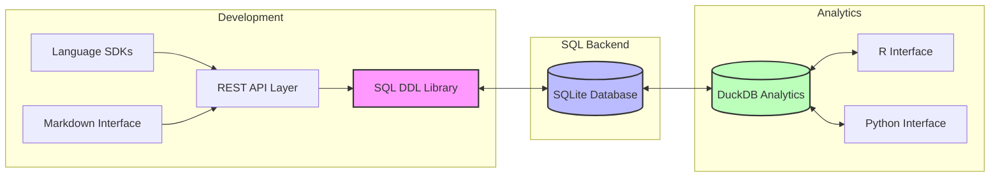
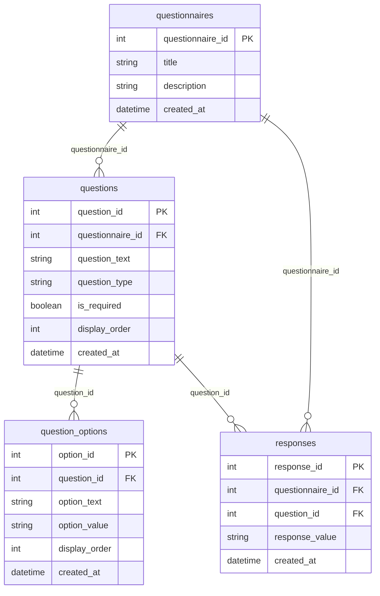
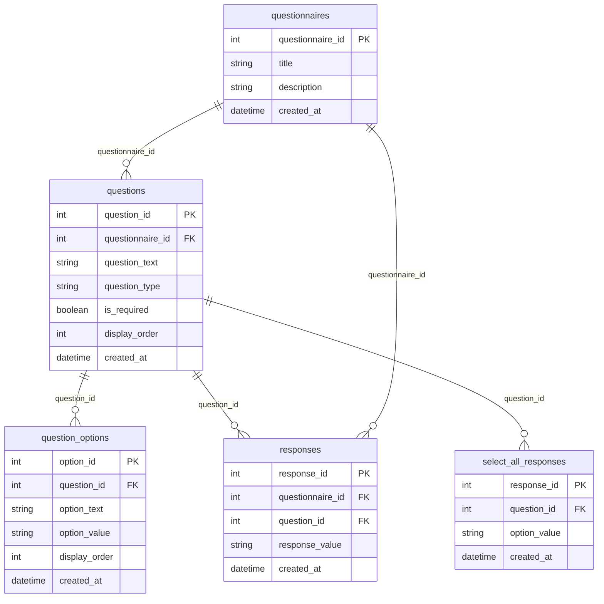
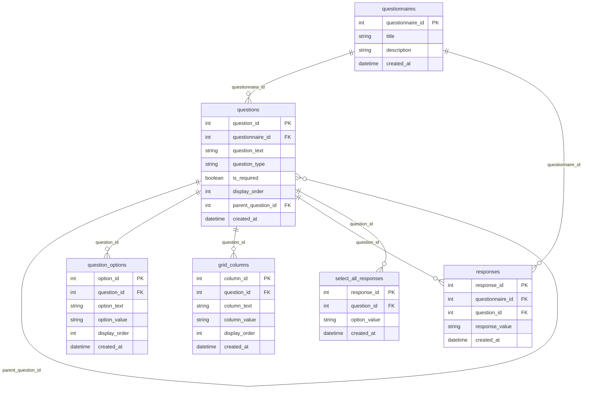
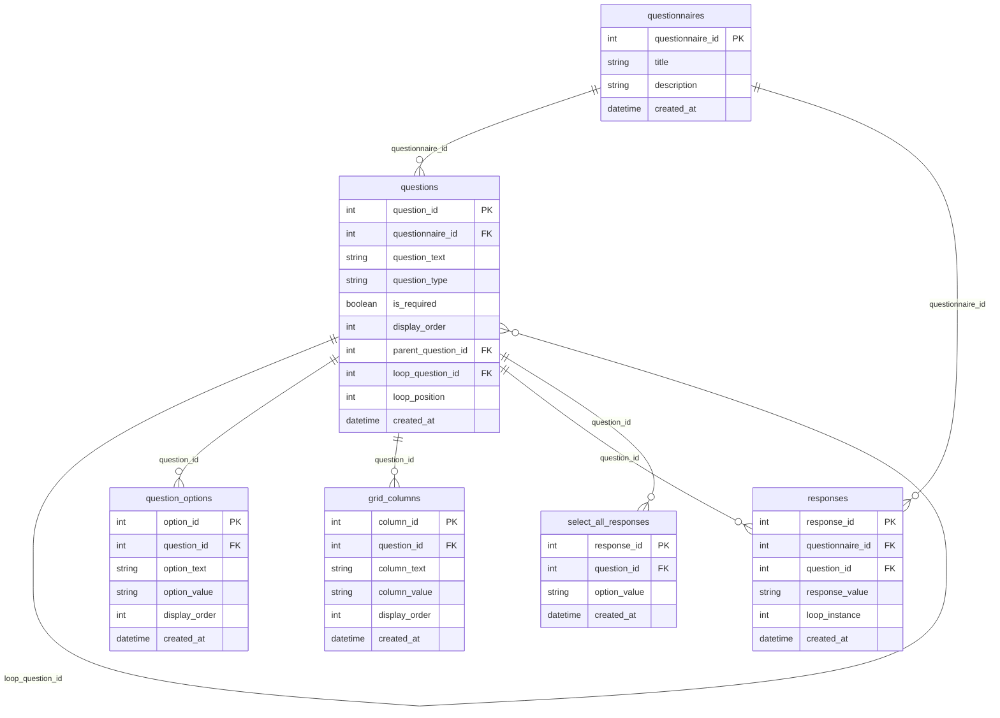

# QuestSQL

A SQL-first questionnaire development and administration system that unifies questionnaire design, data collection, and analysis through a single, well-structured data model. By making the data model itself self-documenting, QuestSQL eliminates the need for separate data dictionaries and ensures documentation is always in sync with the data.

## Table of Contents
- [Vision](#vision)
- [System Architecture](#system-architecture)
- [Progressive Implementation](#progressive-implementation)
  - [Basic Model](#1-basic-model)
  - [Adding Select-All Questions](#2-adding-select-all-questions)
  - [Adding Grid Questions](#3-adding-grid-questions)
  - [Adding Loop Questions](#4-adding-loop-questions)
- [Example Health Questionnaire DDL](#example-health-questionnaire-ddl)
- [Self-Documenting Data Model](#self-documenting-data-model)
- [Implementation Examples](#implementation-examples)
- [Validation and Constraints](#validation-and-constraints)
- [Analytics and Export](#analytics-and-export)
- [Getting Started](#getting-started)
- [Contributing](#contributing)
- [License](#license)

## Vision

QuestSQL aims to revolutionize how health questionnaires are developed, administered, and analyzed by making SQL the foundation of everything. This approach provides several key benefits:

### SQL-First Design
- All questionnaire logic and relationships are encoded directly in SQL
- Questionnaire development happens through SQL DDL statements
- Enables multiple layers of abstraction:
  - REST APIs for DDL operations
  - SDKs for simplified interaction
  - Human-readable markdown language for questionnaire authoring

### Unified Data Model
- Single source of truth for questionnaire structure and data
- Eliminates the need for separate data dictionaries
- Enforces data quality and consistency through database constraints
- Supports both questionnaire development and data collection

### Client-Side Administration
- Lightweight SQLite-based UI for survey administration
- Direct interaction with the data model
- Real-time response collection and storage
- No complex middleware required

### Analytics Toolkit
- DuckDB-powered analysis capabilities
- Support for arbitrary questionnaire analysis
- Extensible API for community contributions
- SDKs for R, Python, and other languages

## System Architecture



The pipeline shows how QuestSQL integrates different components:

1. **Development Layer**
   - SQL DDL Library as the primary development tool
   - REST API as the central interface layer, using DDL for database operations
   - Language SDKs and Markdown interface connect through the API
   - All database operations go through the DDL layer

2. **SQL Backend**
   - SQLite database as the core storage
   - Direct interaction with DDL Library
   - Bidirectional data flow with analytics

3. **Analytics Layer**
   - DuckDB as the core analytics engine
   - Direct interfaces for R and Python
   - Bidirectional data flow with SQLite

## Progressive Implementation

### 1. Basic Model

The simplest implementation supports three core question types: true/false, multiple choice, and text.



#### Basic Schema
```sql
CREATE TABLE questionnaires (
    questionnaire_id INTEGER PRIMARY KEY,
    title TEXT NOT NULL,
    description TEXT,
    created_at TIMESTAMP DEFAULT CURRENT_TIMESTAMP
);

CREATE TABLE questions (
    question_id INTEGER PRIMARY KEY,
    questionnaire_id INTEGER REFERENCES questionnaires(questionnaire_id),
    question_text TEXT NOT NULL,
    question_type TEXT NOT NULL CHECK (question_type IN ('true_false', 'multiple_choice', 'text')),
    is_required BOOLEAN DEFAULT false,
    display_order INTEGER NOT NULL,
    created_at TIMESTAMP DEFAULT CURRENT_TIMESTAMP
);

CREATE TABLE question_options (
    option_id INTEGER PRIMARY KEY,
    question_id INTEGER REFERENCES questions(question_id),
    option_text TEXT NOT NULL,
    option_value TEXT NOT NULL,
    display_order INTEGER NOT NULL,
    created_at TIMESTAMP DEFAULT CURRENT_TIMESTAMP
);

CREATE TABLE responses (
    response_id INTEGER PRIMARY KEY,
    questionnaire_id INTEGER REFERENCES questionnaires(questionnaire_id),
    question_id INTEGER REFERENCES questions(question_id),
    response_value TEXT NOT NULL,
    created_at TIMESTAMP DEFAULT CURRENT_TIMESTAMP
);
```

### 2. Adding Select-All Questions

The next level adds support for select-all-that-apply questions by introducing a separate table for multiple selections.



#### Extended Schema
```sql
-- Add select-all responses table
CREATE TABLE select_all_responses (
    response_id INTEGER PRIMARY KEY,
    question_id INTEGER REFERENCES questions(question_id),
    option_value TEXT NOT NULL,
    created_at TIMESTAMP DEFAULT CURRENT_TIMESTAMP
);

-- Update question type constraint
ALTER TABLE questions
    DROP CONSTRAINT valid_question_type;

ALTER TABLE questions
    ADD CONSTRAINT valid_question_type
    CHECK (question_type IN (
        'true_false',
        'multiple_choice',
        'select_all',
        'text'
    ));
```

### 3. Adding Grid Questions

The next level adds support for grid questions with rows and columns.



#### Extended Schema
```sql
-- Add grid columns table
CREATE TABLE grid_columns (
    column_id INTEGER PRIMARY KEY,
    question_id INTEGER REFERENCES questions(question_id),
    column_text TEXT NOT NULL,
    column_value TEXT NOT NULL,
    display_order INTEGER NOT NULL,
    created_at TIMESTAMP DEFAULT CURRENT_TIMESTAMP
);

-- Update question type constraint
ALTER TABLE questions
    DROP CONSTRAINT valid_question_type;

ALTER TABLE questions
    ADD CONSTRAINT valid_question_type
    CHECK (question_type IN (
        'true_false',
        'multiple_choice',
        'select_all',
        'grid',
        'grid_row',
        'text'
    ));
```

### 4. Adding Loop Questions

The final level adds support for repeating sections through loop questions.



#### Extended Schema
```sql
-- Add loop instance to responses
ALTER TABLE responses
    ADD COLUMN loop_instance INTEGER;

-- Update question type constraint
ALTER TABLE questions
    DROP CONSTRAINT valid_question_type;

ALTER TABLE questions
    ADD CONSTRAINT valid_question_type
    CHECK (question_type IN (
        'true_false',
        'multiple_choice',
        'select_all',
        'grid',
        'grid_row',
        'loop',
        'text'
    ));
```

## Example Health Questionnaire DDL

Here are examples of how to create common health questionnaire question types using QuestSQL's DDL:

### 1. Numeric Scale Questions
```sql
-- Create a numeric scale question (e.g., pain scale 0-10)
CREATE TABLE numeric_scale_questions (
    question_id INTEGER PRIMARY KEY REFERENCES questions(question_id),
    min_value INTEGER NOT NULL,
    max_value INTEGER NOT NULL,
    step_size INTEGER DEFAULT 1,
    left_label TEXT,
    right_label TEXT,
    CONSTRAINT valid_scale CHECK (
        min_value < max_value AND
        step_size > 0 AND
        (max_value - min_value) % step_size = 0
    )
);

-- Example: Pain intensity scale
INSERT INTO questions (questionnaire_id, question_text, question_type, is_required, display_order)
VALUES (1, 'How would you rate your pain on a scale of 0 to 10?', 'numeric_scale', true, 1);

INSERT INTO numeric_scale_questions (question_id, min_value, max_value, left_label, right_label)
VALUES (last_insert_rowid(), 0, 10, 'No pain', 'Worst pain possible');
```

### 2. Multiple Choice with "Other" Option
```sql
-- Create a multiple choice question with "Other" option
CREATE TABLE multiple_choice_questions (
    question_id INTEGER PRIMARY KEY REFERENCES questions(question_id),
    allow_other BOOLEAN DEFAULT false,
    other_label TEXT DEFAULT 'Other (please specify)',
    max_selections INTEGER DEFAULT 1,
    CONSTRAINT valid_selections CHECK (max_selections > 0)
);

-- Example: Primary symptoms
INSERT INTO questions (questionnaire_id, question_text, question_type, is_required, display_order)
VALUES (1, 'Which symptoms are you experiencing? (Select all that apply)', 'multiple_choice', true, 2);

INSERT INTO multiple_choice_questions (question_id, allow_other, max_selections)
VALUES (last_insert_rowid(), true, 10);

-- Add options
INSERT INTO question_options (question_id, option_text, option_value, display_order)
VALUES 
    (last_insert_rowid(), 'Headache', 'headache', 1),
    (last_insert_rowid(), 'Nausea', 'nausea', 2),
    (last_insert_rowid(), 'Fatigue', 'fatigue', 3),
    (last_insert_rowid(), 'Other (please specify)', 'other', 4);
```

### 3. Grid Questions for Related Items
```sql
-- Create a grid question (e.g., symptom severity matrix)
CREATE TABLE grid_questions (
    question_id INTEGER PRIMARY KEY REFERENCES questions(question_id),
    row_type TEXT NOT NULL,
    column_type TEXT NOT NULL,
    allow_skip BOOLEAN DEFAULT false
);

-- Example: Symptom severity and frequency grid
INSERT INTO questions (questionnaire_id, question_text, question_type, is_required, display_order)
VALUES (1, 'Please rate the severity and frequency of your symptoms', 'grid', true, 3);

INSERT INTO grid_questions (question_id, row_type, column_type)
VALUES (last_insert_rowid(), 'symptom', 'rating');

-- Add rows (symptoms)
INSERT INTO grid_rows (question_id, row_text, row_value, display_order)
VALUES 
    (last_insert_rowid(), 'Headache', 'headache', 1),
    (last_insert_rowid(), 'Nausea', 'nausea', 2),
    (last_insert_rowid(), 'Fatigue', 'fatigue', 3);

-- Add columns (rating scale)
INSERT INTO grid_columns (question_id, column_text, column_value, display_order)
VALUES 
    (last_insert_rowid(), 'None', '0', 1),
    (last_insert_rowid(), 'Mild', '1', 2),
    (last_insert_rowid(), 'Moderate', '2', 3),
    (last_insert_rowid(), 'Severe', '3', 4);
```

### 4. Date/Time Questions
```sql
-- Create a date/time question
CREATE TABLE datetime_questions (
    question_id INTEGER PRIMARY KEY REFERENCES questions(question_id),
    date_format TEXT NOT NULL,
    allow_time BOOLEAN DEFAULT false,
    min_date DATE,
    max_date DATE,
    CONSTRAINT valid_date_format CHECK (
        date_format IN ('YYYY-MM-DD', 'MM/DD/YYYY', 'DD/MM/YYYY')
    )
);

-- Example: Last medication taken
INSERT INTO questions (questionnaire_id, question_text, question_type, is_required, display_order)
VALUES (1, 'When did you last take your medication?', 'datetime', true, 4);

INSERT INTO datetime_questions (question_id, date_format, allow_time, min_date)
VALUES (last_insert_rowid(), 'YYYY-MM-DD', true, date('now', '-30 days'));
```

### 5. Conditional Questions
```sql
-- Create a conditional question
CREATE TABLE conditional_questions (
    question_id INTEGER PRIMARY KEY REFERENCES questions(question_id),
    parent_question_id INTEGER REFERENCES questions(question_id),
    condition_type TEXT NOT NULL,
    condition_value TEXT NOT NULL,
    CONSTRAINT valid_condition CHECK (
        condition_type IN ('equals', 'not_equals', 'greater_than', 'less_than')
    )
);

-- Example: Follow-up question based on previous response
INSERT INTO questions (questionnaire_id, question_text, question_type, is_required, display_order)
VALUES (1, 'Have you experienced any side effects?', 'true_false', true, 5);

INSERT INTO questions (questionnaire_id, question_text, question_type, is_required, display_order)
VALUES (1, 'Please describe the side effects:', 'text', false, 6);

INSERT INTO conditional_questions (question_id, parent_question_id, condition_type, condition_value)
VALUES (last_insert_rowid(), last_insert_rowid() - 1, 'equals', 'true');
```

### 6. File Upload Questions
```sql
-- Create a file upload question
CREATE TABLE file_upload_questions (
    question_id INTEGER PRIMARY KEY REFERENCES questions(question_id),
    allowed_types TEXT[] NOT NULL,
    max_size_mb INTEGER NOT NULL,
    max_files INTEGER DEFAULT 1,
    CONSTRAINT valid_file_config CHECK (
        max_size_mb > 0 AND max_files > 0
    )
);

-- Example: Upload medical records
INSERT INTO questions (questionnaire_id, question_text, question_type, is_required, display_order)
VALUES (1, 'Please upload any relevant medical records', 'file_upload', false, 7);

INSERT INTO file_upload_questions (question_id, allowed_types, max_size_mb, max_files)
VALUES (last_insert_rowid(), ARRAY['pdf', 'jpg', 'png'], 10, 3);
```

These examples demonstrate how QuestSQL's DDL can handle various types of health questionnaire questions while maintaining data integrity and validation. Each question type includes:
- Appropriate constraints for data validation
- Support for required/optional questions
- Display order management
- Integration with the core questions table
- Support for conditional logic where needed

## Self-Documenting Data Model

QuestSQL's data model serves as a self-documenting data dictionary, eliminating the need for separate documentation. This is achieved through several key features:

### 1. Explicit Structure
- Table and column names clearly describe their purpose
- Foreign key relationships define data dependencies
- Constraints enforce data rules and validations
- Comments and descriptions are stored in the database

```sql
-- Example of self-documenting table structure
CREATE TABLE questions (
    question_id INTEGER PRIMARY KEY,
    questionnaire_id INTEGER REFERENCES questionnaires(questionnaire_id),
    question_text TEXT NOT NULL,
    question_type TEXT NOT NULL CHECK (question_type IN ('true_false', 'multiple_choice', 'text')),
    is_required BOOLEAN DEFAULT false,
    display_order INTEGER NOT NULL,
    created_at TIMESTAMP DEFAULT CURRENT_TIMESTAMP,
    -- Additional metadata can be added as needed
    description TEXT,
    help_text TEXT,
    validation_rules JSON
);

-- Add table and column comments
COMMENT ON TABLE questions IS 'Stores all questions in questionnaires with their properties and constraints';
COMMENT ON COLUMN questions.question_type IS 'Defines the type of question and its expected response format';
```

### 2. Standardized Concepts
- Medical concepts are stored in a dedicated table
- Each concept has a unique code and description
- Concepts can be referenced across questions
- Supports standardized terminology mapping

```sql
-- Example of concept mapping
CREATE TABLE concepts (
    concept_id INTEGER PRIMARY KEY,
    code TEXT UNIQUE NOT NULL,
    name TEXT NOT NULL,
    description TEXT,
    concept_type TEXT NOT NULL,
    created_at TIMESTAMP DEFAULT CURRENT_TIMESTAMP
);

-- Link questions to concepts
ALTER TABLE questions
    ADD COLUMN concept_id INTEGER REFERENCES concepts(concept_id);
```

### 3. Response Validation
- Response formats are enforced by constraints
- Question types define valid response values
- Validation rules are stored in the database
- Error messages are part of the schema

```sql
-- Example of response validation
CREATE TABLE responses (
    response_id INTEGER PRIMARY KEY,
    questionnaire_id INTEGER REFERENCES questionnaires(questionnaire_id),
    question_id INTEGER REFERENCES questions(question_id),
    response_value TEXT NOT NULL,
    created_at TIMESTAMP DEFAULT CURRENT_TIMESTAMP,
    -- Validation constraints
    CONSTRAINT valid_response CHECK (
        (SELECT question_type FROM questions WHERE question_id = responses.question_id) != 'true_false'
        OR response_value IN ('true', 'false')
    )
);
```

### 4. Queryable Metadata
- All structural information is queryable
- Relationships can be discovered through SQL
- Constraints and rules are accessible
- Documentation is always in sync with the data

```sql
-- Example queries for metadata
-- Get all questions with their concepts
SELECT 
    q.question_text,
    c.name as concept_name,
    c.description as concept_description
FROM questions q
LEFT JOIN concepts c ON q.concept_id = c.concept_id;

-- Get validation rules for a question
SELECT 
    q.question_text,
    q.validation_rules
FROM questions q
WHERE q.validation_rules IS NOT NULL;
```

### 5. Version Control
- Schema changes are tracked in SQL
- Migration scripts document evolution
- Historical changes are preserved
- Documentation stays current

```sql
-- Example of version tracking
CREATE TABLE schema_versions (
    version_id INTEGER PRIMARY KEY,
    version_number TEXT NOT NULL,
    applied_at TIMESTAMP DEFAULT CURRENT_TIMESTAMP,
    description TEXT,
    migration_script TEXT
);
```

This self-documenting approach ensures:
1. Single source of truth for data structure
2. Automatic synchronization of documentation and data
3. Queryable metadata for analysis
4. Standardized concept mapping
5. Enforced data quality rules

## Implementation Examples

[Previous implementation examples remain the same, but organized by complexity level]

## Validation and Constraints

[Previous validation section remains the same]

## Analytics and Export

[Previous analytics section remains the same]

## Getting Started

[Coming soon]

## Contributing

[Coming soon]

## License

[Coming soon]