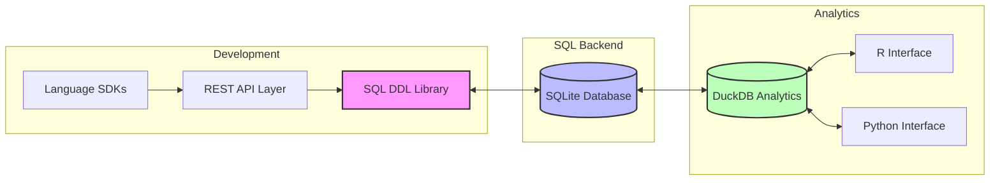
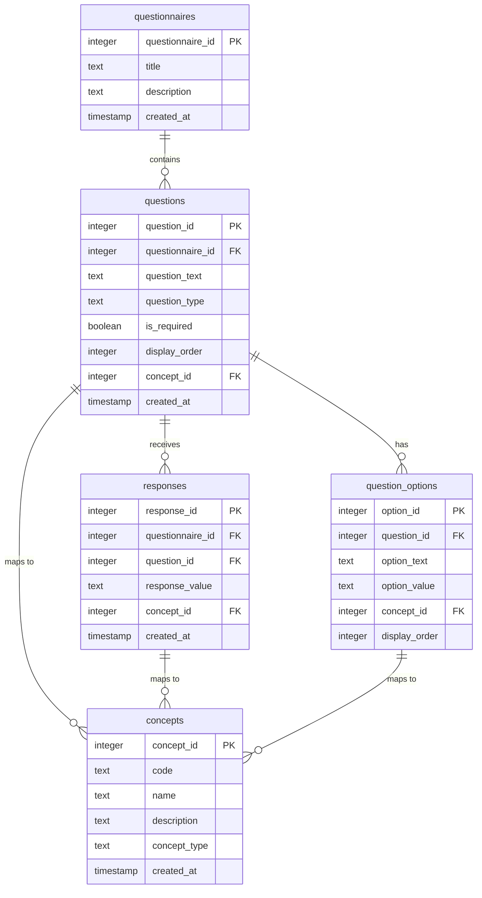
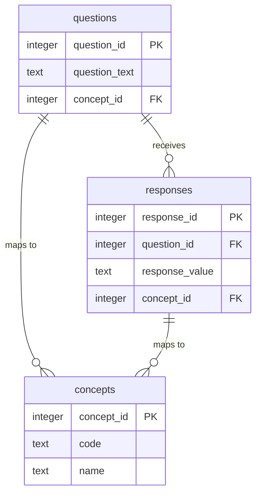

# QuestSQL

A SQL-first questionnaire development and administration system that unifies questionnaire design, data collection, and analysis through a single, well-structured data model. Built with OMOP CDM compatibility in mind, it enables seamless integration with clinical data systems.

## Table of Contents
1. [Overview](#overview)
2. [Architecture](#architecture)
3. [Core Data Model](#core-data-model)
4. [Progressive Implementation](#progressive-implementation)
5. [OMOP Integration](#omop-integration)
6. [Examples](#examples)

## Overview

QuestSQL provides a unified approach to health questionnaire development and administration:

- **SQL-First Design**: All questionnaire logic encoded directly in SQL
- **OMOP Compatible**: Direct mapping to clinical concepts and vocabularies
- **Self-Documenting**: Schema serves as the data dictionary
- **Analytics Ready**: Built-in support for clinical data analysis

## Architecture

The system is built around three core components:



### Key Components
1. **Development Layer**
   - SQL DDL Library for schema management
   - REST API for remote operations
   - SDKs for language-specific integration

2. **SQL Backend**
   - SQLite for local data storage
   - Direct DDL interaction
   - Real-time data collection

3. **Analytics Layer**
   - DuckDB for high-performance analysis
   - R and Python interfaces
   - Extensible analytics toolkit

## Core Data Model

The foundation of QuestSQL is its concept-mapped data model:



### Key Features
- Questions map to standard clinical concepts (e.g., "Blood Pressure" maps to concept_id 3004249)
- Responses map to standard clinical values (e.g., "High" maps to concept_id 4171373)
- Question options map to standard values (e.g., "Yes" maps to concept_id 4188539)
- Built-in support for multiple question types
- Standardized value sets through concept mapping
- Temporal data tracking

### Question-Response Pairs

The fundamental mappable unit in QuestSQL is the question-response pair:



This design enables:

1. **Complete Clinical Observations**
   ```sql
   -- Example: Blood pressure observation
   INSERT INTO questions (
       question_text,
       concept_id
   ) VALUES (
       'What is your blood pressure?',
       3004249  -- Blood pressure concept
   );

   INSERT INTO responses (
       question_id,
       response_value,
       concept_id
   ) VALUES (
       1,
       '140/90',
       4171373  -- High blood pressure concept
   );
   ```

2. **OMOP CDM Mapping**
   ```sql
   -- Map to OMOP OBSERVATION table
   INSERT INTO observation (
       person_id,
       observation_concept_id,  -- From question.concept_id
       observation_date,
       value_as_concept_id,     -- From response.concept_id
       value_as_string         -- From response.response_value
   )
   SELECT 
       p.person_id,
       q.concept_id,
       r.created_at,
       r.concept_id,
       r.response_value
   FROM questions q
   JOIN responses r ON q.question_id = r.question_id
   JOIN persons p ON r.person_id = p.person_id;
   ```

3. **Clinical Analysis**
   ```sql
   -- Example: Analyze blood pressure responses
   SELECT 
       c1.name as question_concept,
       c2.name as response_concept,
       COUNT(*) as frequency
   FROM questions q
   JOIN responses r ON q.question_id = r.question_id
   JOIN concepts c1 ON q.concept_id = c1.concept_id
   JOIN concepts c2 ON r.concept_id = c2.concept_id
   WHERE q.concept_id = 3004249  -- Blood pressure
   GROUP BY c1.name, c2.name;
   ```

This approach ensures:
- Complete clinical context for each observation
- Standardized concept mapping
- Direct OMOP CDM compatibility
- Consistent data analysis

## Progressive Implementation

QuestSQL is built incrementally, with each level adding new capabilities:

### 1. Basic Model
The foundation supports core question types:
- True/False questions
- Multiple choice questions
- Text responses

```sql
CREATE TABLE questions (
    question_id INTEGER PRIMARY KEY,
    questionnaire_id INTEGER REFERENCES questionnaires(questionnaire_id),
    question_text TEXT NOT NULL,
    question_type TEXT NOT NULL CHECK (
        question_type IN ('true_false', 'multiple_choice', 'text')
    ),
    concept_id INTEGER REFERENCES concepts(concept_id),
    is_required BOOLEAN DEFAULT false,
    display_order INTEGER NOT NULL,
    created_at TIMESTAMP DEFAULT CURRENT_TIMESTAMP
);
```

### 2. Select-All Questions
Adds support for multiple selections:

```sql
CREATE TABLE select_all_responses (
    response_id INTEGER PRIMARY KEY,
    question_id INTEGER REFERENCES questions(question_id),
    option_value TEXT NOT NULL,
    concept_id INTEGER REFERENCES concepts(concept_id),
    created_at TIMESTAMP DEFAULT CURRENT_TIMESTAMP
);

-- Update valid question types
ALTER TABLE questions
    ADD CONSTRAINT valid_question_type CHECK (
        question_type IN (
            'true_false', 'multiple_choice', 
            'select_all', 'text'
        )
    );
```

### 3. Grid Questions
Adds support for matrix-style questions:

```sql
CREATE TABLE grid_columns (
    column_id INTEGER PRIMARY KEY,
    question_id INTEGER REFERENCES questions(question_id),
    column_text TEXT NOT NULL,
    column_value TEXT NOT NULL,
    concept_id INTEGER REFERENCES concepts(concept_id),
    display_order INTEGER NOT NULL,
    created_at TIMESTAMP DEFAULT CURRENT_TIMESTAMP
);

-- Update valid question types
ALTER TABLE questions
    ADD CONSTRAINT valid_question_type CHECK (
        question_type IN (
            'true_false', 'multiple_choice', 
            'select_all', 'grid', 'grid_row', 'text'
        )
    );
```

### 4. Loop Questions
Adds support for repeating sections:

```sql
ALTER TABLE questions
    ADD COLUMN loop_question_id INTEGER REFERENCES questions(question_id),
    ADD COLUMN loop_position INTEGER;

ALTER TABLE responses
    ADD COLUMN loop_instance INTEGER;

-- Update valid question types
ALTER TABLE questions
    ADD CONSTRAINT valid_question_type CHECK (
        question_type IN (
            'true_false', 'multiple_choice', 'select_all',
            'grid', 'grid_row', 'loop', 'text'
        )
    );
```

## OMOP Integration

QuestSQL directly maps to OMOP CDM through concept relationships:

### Domain Mapping
```sql
-- Example: Blood pressure measurement
INSERT INTO questions (
    questionnaire_id,
    question_text,
    question_type,
    concept_id,
    domain_id
) VALUES (
    1,
    'What is your blood pressure?',
    'numeric',
    3004249,  -- Blood pressure concept
    'Measurement'
);

-- Example: Medication adherence
INSERT INTO questions (
    questionnaire_id,
    question_text,
    question_type,
    concept_id,
    domain_id
) VALUES (
    1,
    'Are you taking your prescribed medications?',
    'multiple_choice',
    4023213,  -- Medication adherence concept
    'Drug'
);
```

### Vocabulary Support
```sql
-- Example: LOINC-based lab question
INSERT INTO questions (
    questionnaire_id,
    question_text,
    question_type,
    concept_id,
    vocabulary_id
) VALUES (
    1,
    'What was your last HbA1c result?',
    'numeric',
    3004410,  -- HbA1c concept
    'LOINC'
);

-- Example: SNOMED-based condition question
INSERT INTO questions (
    questionnaire_id,
    question_text,
    question_type,
    concept_id,
    vocabulary_id
) VALUES (
    1,
    'Have you been diagnosed with diabetes?',
    'true_false',
    201820,  -- Diabetes concept
    'SNOMED'
);
```

## Examples

### Health Assessment Questionnaire
```sql
-- Create questionnaire
INSERT INTO questionnaires (title, description) VALUES (
    'Health Assessment',
    'Basic health status assessment'
);

-- Add blood pressure question
INSERT INTO questions (
    questionnaire_id,
    question_text,
    question_type,
    concept_id
) VALUES (
    1,
    'What is your blood pressure?',
    'numeric',
    3004249  -- Blood pressure concept
);

-- Add response options
INSERT INTO question_options (
    question_id,
    option_text,
    option_value,
    concept_id
) VALUES 
(1, 'Normal', 'normal', 4171374),
(1, 'High', 'high', 4171373),
(1, 'Low', 'low', 4171375);
```

### Query Examples
```sql
-- Get all questions with their concepts
SELECT 
    q.question_text,
    c.name as concept_name,
    c.code as concept_code
FROM questions q
JOIN concepts c ON q.concept_id = c.concept_id;

-- Get responses with standardized values
SELECT 
    r.response_value,
    c.name as standardized_value
FROM responses r
JOIN concepts c ON r.concept_id = c.concept_id;
```

## Validation and Constraints

QuestSQL uses SQL constraints and assertions to ensure data integrity and validity:

### 1. Question Type Validation
```sql
-- Enforce valid question types
CREATE TABLE questions (
    -- ... other columns ...
    question_type TEXT NOT NULL CHECK (
        question_type IN (
            'true_false',
            'multiple_choice',
            'select_all',
            'grid',
            'grid_row',
            'loop',
            'text',
            'numeric',
            'datetime'
        )
    )
);

-- Ensure grid questions have columns
CREATE TRIGGER validate_grid_question
AFTER INSERT ON questions
BEGIN
    SELECT CASE
        WHEN NEW.question_type = 'grid' AND NOT EXISTS (
            SELECT 1 FROM grid_columns 
            WHERE question_id = NEW.question_id
        )
        THEN RAISE(ABORT, 'Grid questions must have at least one column')
    END;
END;
```

### 2. Response Validation
```sql
-- Validate numeric responses
CREATE TRIGGER validate_numeric_response
BEFORE INSERT ON responses
BEGIN
    SELECT CASE
        WHEN EXISTS (
            SELECT 1 FROM questions q
            WHERE q.question_id = NEW.question_id
            AND q.question_type = 'numeric'
        )
        AND CAST(NEW.response_value AS DECIMAL) IS NULL
        THEN RAISE(ABORT, 'Invalid numeric response')
    END;
END;

-- Validate datetime responses
CREATE TRIGGER validate_datetime_response
BEFORE INSERT ON responses
BEGIN
    SELECT CASE
        WHEN EXISTS (
            SELECT 1 FROM questions q
            WHERE q.question_id = NEW.question_id
            AND q.question_type = 'datetime'
        )
        AND datetime(NEW.response_value) IS NULL
        THEN RAISE(ABORT, 'Invalid datetime response')
    END;
END;
```

### 3. Required Field Validation
```sql
-- Ensure required questions are answered
CREATE TRIGGER validate_required_questions
AFTER INSERT ON questionnaires
BEGIN
    SELECT CASE
        WHEN EXISTS (
            SELECT 1 FROM questions q
            WHERE q.questionnaire_id = NEW.questionnaire_id
            AND q.is_required = true
            AND NOT EXISTS (
                SELECT 1 FROM responses r
                WHERE r.question_id = q.question_id
            )
        )
        THEN RAISE(ABORT, 'Required questions must be answered')
    END;
END;
```

### 4. Concept Mapping Validation
```sql
-- Ensure questions have valid concept mappings
CREATE TRIGGER validate_concept_mapping
BEFORE INSERT ON questions
BEGIN
    SELECT CASE
        WHEN NEW.concept_id IS NOT NULL
        AND NOT EXISTS (
            SELECT 1 FROM concepts c
            WHERE c.concept_id = NEW.concept_id
        )
        THEN RAISE(ABORT, 'Invalid concept mapping')
    END;
END;

-- Validate response concept mappings
CREATE TRIGGER validate_response_concept
BEFORE INSERT ON responses
BEGIN
    SELECT CASE
        WHEN NEW.concept_id IS NOT NULL
        AND NOT EXISTS (
            SELECT 1 FROM concepts c
            WHERE c.concept_id = NEW.concept_id
        )
        THEN RAISE(ABORT, 'Invalid response concept mapping')
    END;
END;
```

### 5. Grid Question Validation
```sql
-- Ensure grid questions have valid structure
CREATE TRIGGER validate_grid_structure
AFTER INSERT ON grid_columns
BEGIN
    SELECT CASE
        WHEN EXISTS (
            SELECT 1 FROM questions q
            WHERE q.question_id = NEW.question_id
            AND q.question_type != 'grid'
        )
        THEN RAISE(ABORT, 'Grid columns only allowed for grid questions')
    END;
END;

-- Validate grid responses
CREATE TRIGGER validate_grid_response
BEFORE INSERT ON responses
BEGIN
    SELECT CASE
        WHEN EXISTS (
            SELECT 1 FROM questions q
            WHERE q.question_id = NEW.question_id
            AND q.question_type = 'grid'
        )
        AND NOT EXISTS (
            SELECT 1 FROM grid_columns gc
            WHERE gc.question_id = NEW.question_id
            AND gc.column_value = NEW.response_value
        )
        THEN RAISE(ABORT, 'Invalid grid response value')
    END;
END;
```

### 6. Loop Question Validation
```sql
-- Validate loop question structure
CREATE TRIGGER validate_loop_structure
BEFORE INSERT ON questions
BEGIN
    SELECT CASE
        WHEN NEW.question_type = 'loop'
        AND NEW.loop_question_id IS NULL
        THEN RAISE(ABORT, 'Loop questions must reference a parent question')
    END;
END;

-- Ensure loop responses have valid instances
CREATE TRIGGER validate_loop_response
BEFORE INSERT ON responses
BEGIN
    SELECT CASE
        WHEN EXISTS (
            SELECT 1 FROM questions q
            WHERE q.question_id = NEW.question_id
            AND q.question_type = 'loop'
        )
        AND NEW.loop_instance IS NULL
        THEN RAISE(ABORT, 'Loop responses must specify an instance')
    END;
END;
```

### 7. Temporal Validation
```sql
-- Ensure response timestamps are valid
CREATE TRIGGER validate_response_timestamp
BEFORE INSERT ON responses
BEGIN
    SELECT CASE
        WHEN NEW.created_at > CURRENT_TIMESTAMP
        THEN RAISE(ABORT, 'Response timestamp cannot be in the future')
    END;
END;

-- Validate questionnaire completion order
CREATE TRIGGER validate_questionnaire_order
BEFORE INSERT ON responses
BEGIN
    SELECT CASE
        WHEN EXISTS (
            SELECT 1 FROM responses r
            WHERE r.questionnaire_id = NEW.questionnaire_id
            AND r.created_at > NEW.created_at
        )
        THEN RAISE(ABORT, 'Responses must be inserted in chronological order')
    END;
END;
```

These validations ensure:
- Data type consistency
- Required field completion
- Valid concept mappings
- Proper question structure
- Temporal integrity
- Response validity

## Analytics and Export

[Previous analytics section remains the same]

## Getting Started

[Coming soon]

## Contributing

[Coming soon]

## License

[Coming soon]

## Concept Mapping

The model uses concept mapping similar to OMOP CDM:

1. **Question Concepts**
   - Each question can map to a standard clinical concept
   - Example: A question about "Blood Pressure" maps to concept_id 3004249
   - This enables standardized question interpretation

2. **Response Concepts**
   - Each response can map to a standard clinical value
   - Example: A response of "High" to a blood pressure question maps to concept_id 4171373
   - This enables standardized response interpretation

3. **Option Concepts**
   - Multiple choice options can map to standard values
   - Example: "Yes" maps to concept_id 4188539
   - This ensures consistent value representation

4. **Grid Concepts**
   - Grid rows and columns can map to standard concepts
   - Example: A row for "Systolic" maps to concept_id 3004249
   - This enables structured data collection

### OMOP CDM Compatibility

QuestSQL's concept mapping aligns directly with OMOP CDM's design principles:

1. **Direct Mapping to OMOP**
   - Questions map to OMOP Concepts (CONCEPT table)
   - Responses map to OMOP Values (CONCEPT table)
   - Grid elements map to OMOP Measurements (MEASUREMENT table)
   - All mappings use standard OMOP concept IDs

2. **Observation Structure**
   - Questions become OMOP Observations
   - Responses become OMOP Values
   - Grid questions map to OMOP Measurements
   - Maintains temporal relationships

3. **Vocabulary Integration**
   - Uses OMOP's standard vocabularies
   - Supports SNOMED CT, LOINC, RxNorm, etc.
   - Enables cross-vocabulary mapping
   - Maintains concept hierarchies

4. **Data Quality**
   - Enforces standard concept usage
   - Validates against OMOP vocabularies
   - Maintains data consistency
   - Supports quality checks

### OMOP Mapping Support

QuestSQL provides comprehensive support for mapping questionnaire elements to specific OMOP CDM domains and vocabularies:

1. **Domain-Specific Mapping**
   - **Condition/Disease Questions**
     ```sql
     -- Example: Diabetes screening question
     INSERT INTO questions (
         questionnaire_id,
         question_text,
         question_type,
         concept_id,
         domain_id
     ) VALUES (
         1,
         'Have you been diagnosed with diabetes?',
         'multiple_choice',
         201820,  -- Diabetes mellitus concept
         'Condition'
     );
     ```

   - **Measurement Questions**
     ```sql
     -- Example: Blood pressure measurement
     INSERT INTO questions (
         questionnaire_id,
         question_text,
         question_type,
         concept_id,
         domain_id
     ) VALUES (
         1,
         'What is your blood pressure?',
         'grid',
         3004249,  -- Blood pressure concept
         'Measurement'
     );
     ```

   - **Drug/Medication Questions**
     ```sql
     -- Example: Medication adherence
     INSERT INTO questions (
         questionnaire_id,
         question_text,
         question_type,
         concept_id,
         domain_id
     ) VALUES (
         1,
         'Are you taking your prescribed medications?',
         'multiple_choice',
         4023213,  -- Medication adherence concept
         'Drug'
     );
     ```

2. **Vocabulary-Specific Development**
   - **SNOMED CT Questions**
     ```sql
     -- Example: Pain assessment using SNOMED
     INSERT INTO questions (
         questionnaire_id,
         question_text,
         question_type,
         concept_id,
         vocabulary_id
     ) VALUES (
         1,
         'Rate your pain level',
         'grid',
         36714913,  -- Pain severity concept
         'SNOMED'
     );
     ```