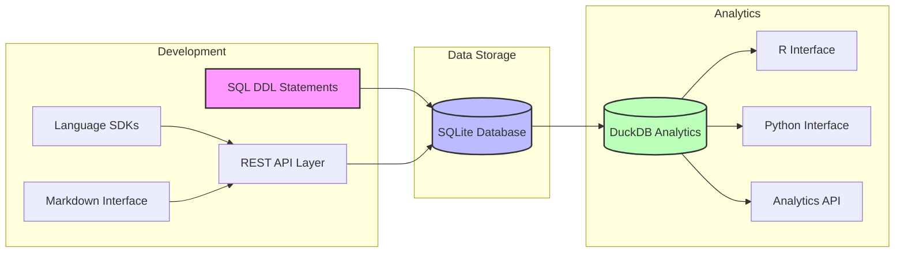
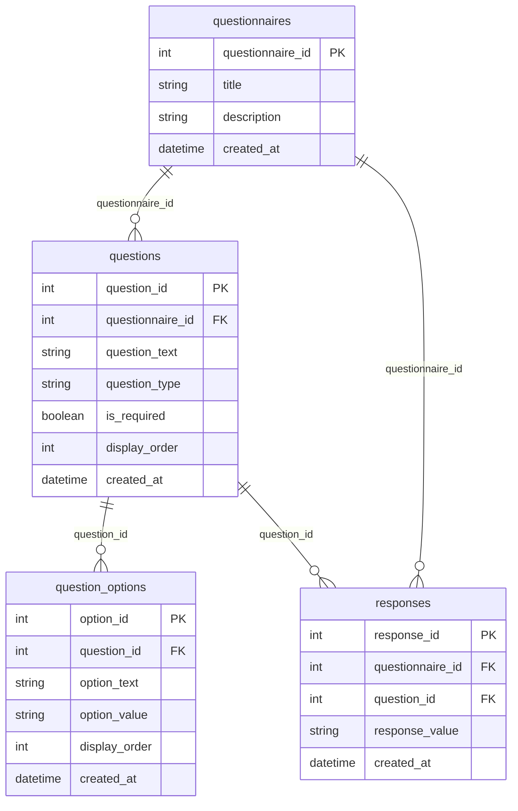
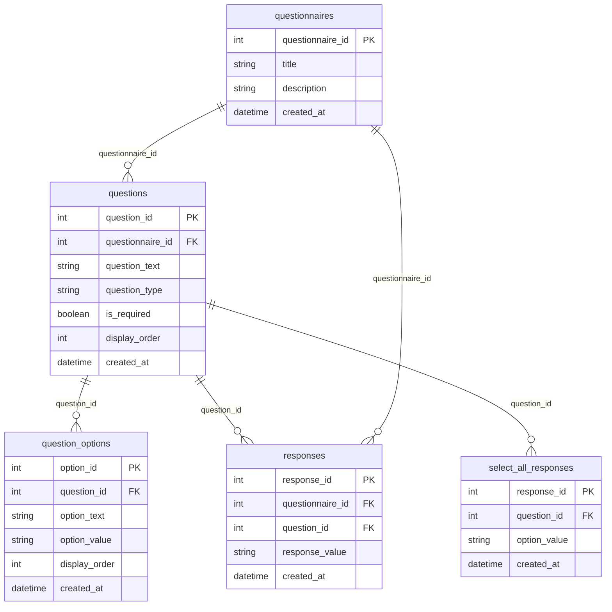
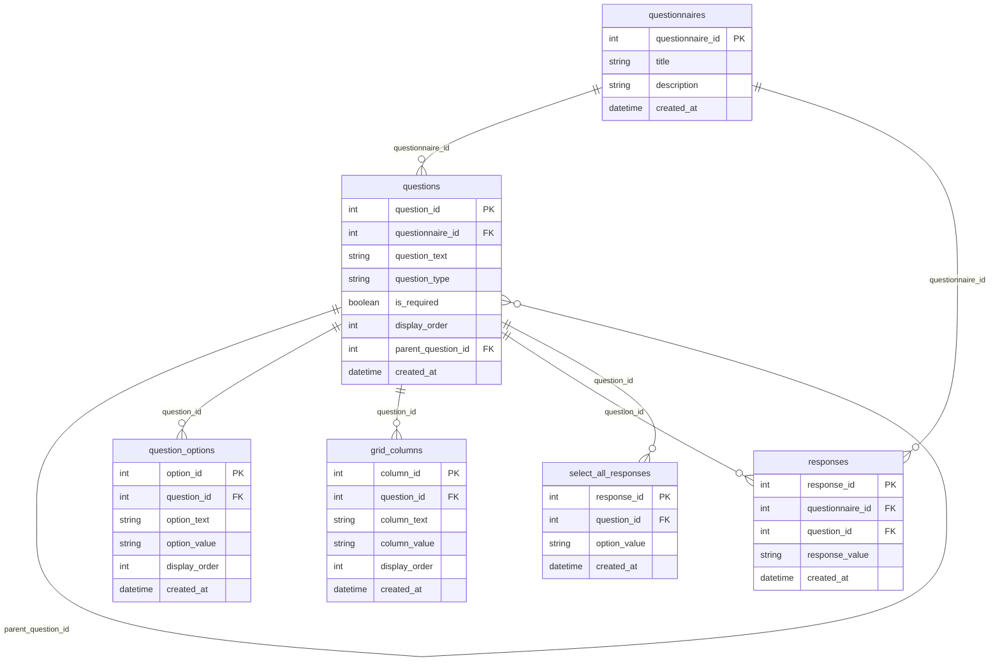
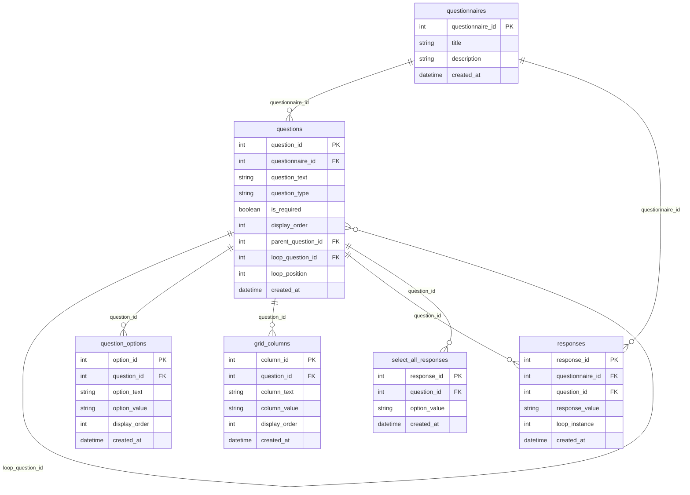

# QuestSQL

A SQL-first questionnaire development and administration system that unifies questionnaire design, data collection, and analysis through a single, well-structured data model.

## Vision

QuestSQL aims to revolutionize how health questionnaires are developed, administered, and analyzed by making SQL the foundation of everything. This approach provides several key benefits:

### SQL-First Design
- All questionnaire logic and relationships are encoded directly in SQL
- Questionnaire development happens through SQL DDL statements
- Enables multiple layers of abstraction:
  - REST APIs for DDL operations
  - SDKs for simplified interaction
  - Human-readable markdown language for questionnaire authoring

### Unified Data Model
- Single source of truth for questionnaire structure and data
- Eliminates the need for separate data dictionaries
- Enforces data quality and consistency through database constraints
- Supports both questionnaire development and data collection

### Client-Side Administration
- Lightweight SQLite-based UI for survey administration
- Direct interaction with the data model
- Real-time response collection and storage
- No complex middleware required

### Analytics Toolkit
- DuckDB-powered analysis capabilities
- Support for arbitrary questionnaire analysis
- Extensible API for community contributions
- SDKs for R, Python, and other languages

## System Architecture



## Progressive Implementation

### 1. Basic Model

The simplest implementation supports three core question types: true/false, multiple choice, and text.



#### Basic Schema
```sql
CREATE TABLE questionnaires (
    questionnaire_id INTEGER PRIMARY KEY,
    title TEXT NOT NULL,
    description TEXT,
    created_at TIMESTAMP DEFAULT CURRENT_TIMESTAMP
);

CREATE TABLE questions (
    question_id INTEGER PRIMARY KEY,
    questionnaire_id INTEGER REFERENCES questionnaires(questionnaire_id),
    question_text TEXT NOT NULL,
    question_type TEXT NOT NULL CHECK (question_type IN ('true_false', 'multiple_choice', 'text')),
    is_required BOOLEAN DEFAULT false,
    display_order INTEGER NOT NULL,
    created_at TIMESTAMP DEFAULT CURRENT_TIMESTAMP
);

CREATE TABLE question_options (
    option_id INTEGER PRIMARY KEY,
    question_id INTEGER REFERENCES questions(question_id),
    option_text TEXT NOT NULL,
    option_value TEXT NOT NULL,
    display_order INTEGER NOT NULL,
    created_at TIMESTAMP DEFAULT CURRENT_TIMESTAMP
);

CREATE TABLE responses (
    response_id INTEGER PRIMARY KEY,
    questionnaire_id INTEGER REFERENCES questionnaires(questionnaire_id),
    question_id INTEGER REFERENCES questions(question_id),
    response_value TEXT NOT NULL,
    created_at TIMESTAMP DEFAULT CURRENT_TIMESTAMP
);
```

### 2. Adding Select-All Questions

The next level adds support for select-all-that-apply questions by introducing a separate table for multiple selections.



#### Extended Schema
```sql
-- Add select-all responses table
CREATE TABLE select_all_responses (
    response_id INTEGER PRIMARY KEY,
    question_id INTEGER REFERENCES questions(question_id),
    option_value TEXT NOT NULL,
    created_at TIMESTAMP DEFAULT CURRENT_TIMESTAMP
);

-- Update question type constraint
ALTER TABLE questions
    DROP CONSTRAINT valid_question_type;

ALTER TABLE questions
    ADD CONSTRAINT valid_question_type
    CHECK (question_type IN (
        'true_false',
        'multiple_choice',
        'select_all',
        'text'
    ));
```

### 3. Adding Grid Questions

The next level adds support for grid questions with rows and columns.



#### Extended Schema
```sql
-- Add grid columns table
CREATE TABLE grid_columns (
    column_id INTEGER PRIMARY KEY,
    question_id INTEGER REFERENCES questions(question_id),
    column_text TEXT NOT NULL,
    column_value TEXT NOT NULL,
    display_order INTEGER NOT NULL,
    created_at TIMESTAMP DEFAULT CURRENT_TIMESTAMP
);

-- Update question type constraint
ALTER TABLE questions
    DROP CONSTRAINT valid_question_type;

ALTER TABLE questions
    ADD CONSTRAINT valid_question_type
    CHECK (question_type IN (
        'true_false',
        'multiple_choice',
        'select_all',
        'grid',
        'grid_row',
        'text'
    ));
```

### 4. Adding Loop Questions

The final level adds support for repeating sections through loop questions.



#### Extended Schema
```sql
-- Add loop instance to responses
ALTER TABLE responses
    ADD COLUMN loop_instance INTEGER;

-- Update question type constraint
ALTER TABLE questions
    DROP CONSTRAINT valid_question_type;

ALTER TABLE questions
    ADD CONSTRAINT valid_question_type
    CHECK (question_type IN (
        'true_false',
        'multiple_choice',
        'select_all',
        'grid',
        'grid_row',
        'loop',
        'text'
    ));
```

## Implementation Examples

[Previous implementation examples remain the same, but organized by complexity level]

## Validation and Constraints

[Previous validation section remains the same]

## Analytics and Export

[Previous analytics section remains the same]

## Getting Started

[Coming soon]

## Contributing

[Coming soon]

## License

[Coming soon]