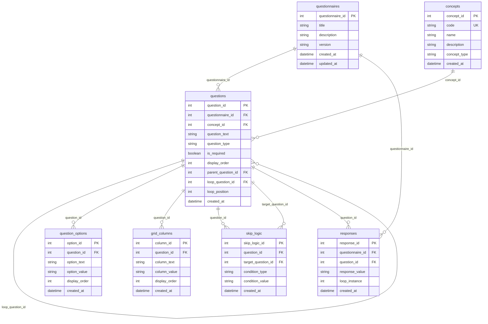

# Questionnaire Database Schema

This is a response-centric relational data model for health questionnaire data that supports various question types, skip logic, and loop questions.

## Entity Relationship Diagram

## Schema Description

The schema consists of the following tables:

1. `questionnaires`: Stores metadata about questionnaires
   - Primary key: `questionnaire_id`
   - Contains title, description, version, and timestamps

2. `concepts`: Stores standardized medical concepts
   - Primary key: `concept_id`
   - Contains code (unique), name, description, and type
   - Used for standardized terminology mapping

3. `questions`: Core table for all question types
   - Primary key: `question_id`
   - Supports various question types (true/false, multiple choice, grid, etc.)
   - Handles nested questions and loop questions
   - Links to questionnaires and concepts

4. `question_options`: Options for multiple choice and select-all questions
   - Primary key: `option_id`
   - Contains option text, value, and display order
   - Links to parent question

5. `grid_columns`: Columns for grid questions
   - Primary key: `column_id`
   - Contains column text, value, and display order
   - Links to parent question

6. `skip_logic`: Conditional question display logic
   - Primary key: `skip_logic_id`
   - Defines conditions and target questions
   - Links source and target questions

7. `responses`: Stores all user responses
   - Primary key: `response_id`
   - Links to both questionnaire and specific question
   - Supports loop questions through `loop_instance`

## Features

- Supports all common question types:
  - True/false
  - Multiple choice
  - Select-all-that-apply
  - Grid questions
  - Free text
  - Loop questions
- Skip logic for conditional question display
- Standardized concept mapping
- Nested questions
- Loop questions for repeating sections
- Timestamps for tracking creation/updates 