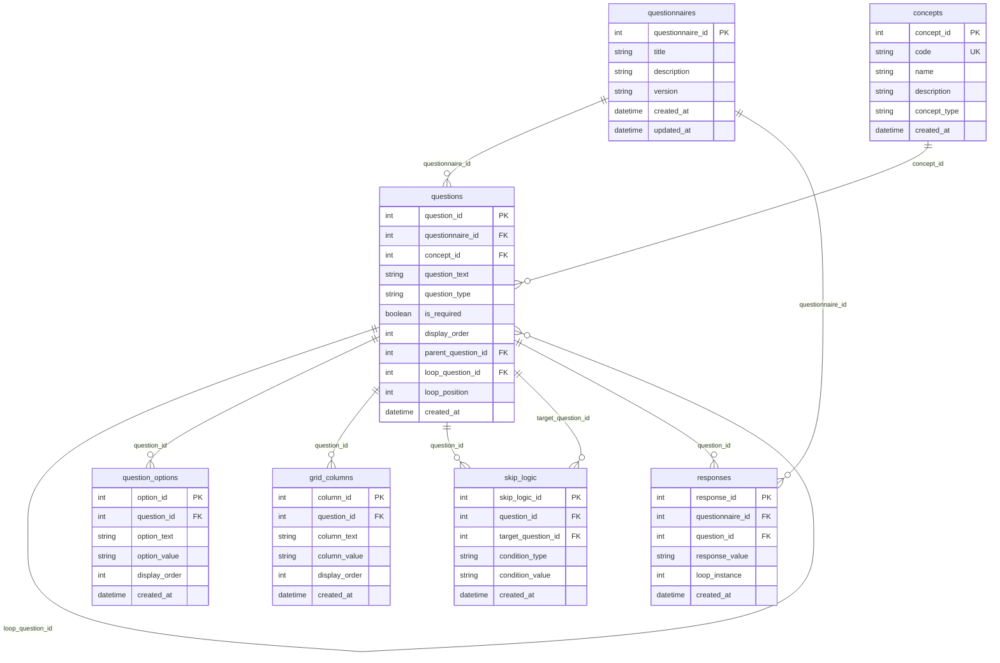

# QuestSQL

A SQL-first questionnaire development and administration system that unifies questionnaire design, data collection, and analysis through a single, well-structured data model.

## Vision

QuestSQL aims to revolutionize how health questionnaires are developed, administered, and analyzed by making SQL the foundation of everything. This approach provides several key benefits:

### SQL-First Design
- All questionnaire logic and relationships are encoded directly in SQL
- Questionnaire development happens through SQL DDL statements
- Enables multiple layers of abstraction:
  - REST APIs for DDL operations
  - SDKs for simplified interaction
  - Human-readable markdown language for questionnaire authoring

### Unified Data Model
- Single source of truth for questionnaire structure and data
- Eliminates the need for separate data dictionaries
- Enforces data quality and consistency through database constraints
- Supports both questionnaire development and data collection

### Client-Side Administration
- Lightweight SQLite-based UI for survey administration
- Direct interaction with the data model
- Real-time response collection and storage
- No complex middleware required

### Analytics Toolkit
- DuckDB-powered analysis capabilities
- Support for arbitrary questionnaire analysis
- Extensible API for community contributions
- SDKs for R, Python, and other languages

## Core Principles

1. **Simplicity First**
   - Minimal dependencies
   - Clear, straightforward data model
   - Easy to understand and extend

2. **Quality by Design**
   - Built-in constraints for data quality
   - Enforced best practices
   - Standardized questionnaire structure

3. **Extensibility**
   - Flexible enough for various study needs
   - Community-driven development
   - Multiple abstraction layers

4. **Integration**
   - Unified development and administration
   - Seamless analysis capabilities
   - No separate documentation needed

## Data Model

The schema is designed to support all aspects of questionnaire lifecycle:

## Features

- **Questionnaire Development**
  - SQL-based questionnaire definition
  - Support for all common question types
  - Skip logic and conditional questions
  - Loop questions for repeating sections
  - Grid questions
  - Standardized concept mapping

- **Survey Administration**
  - SQLite-based client UI
  - Real-time response collection
  - Offline capability
  - Data validation

- **Analysis**
  - DuckDB-powered analytics
  - Support for arbitrary questionnaires
  - Extensible analysis toolkit
  - Multiple language SDKs

## Getting Started

[Coming soon]

## Contributing

[Coming soon]

## License

[Coming soon] 