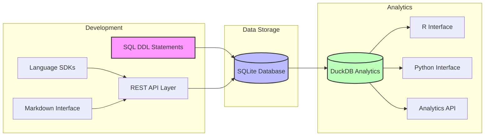
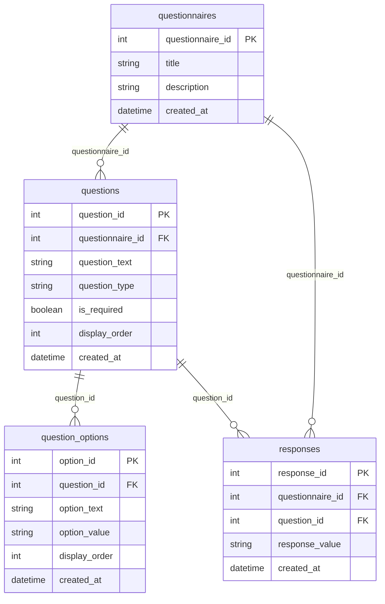
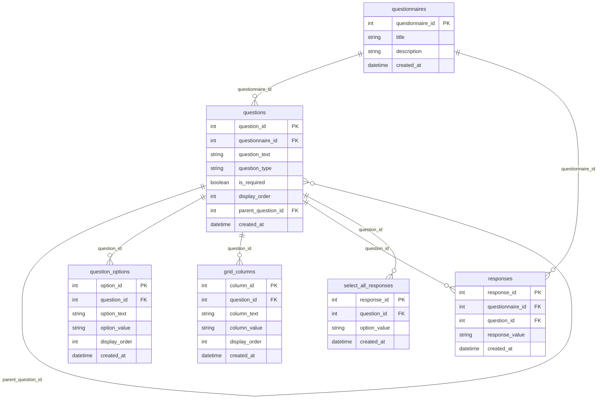
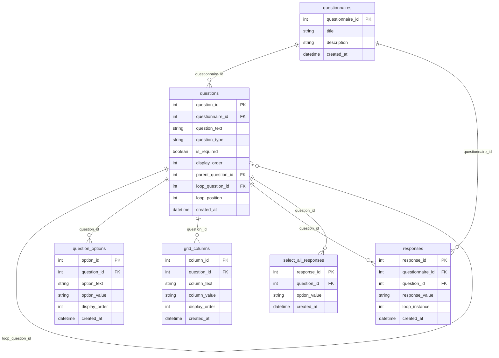
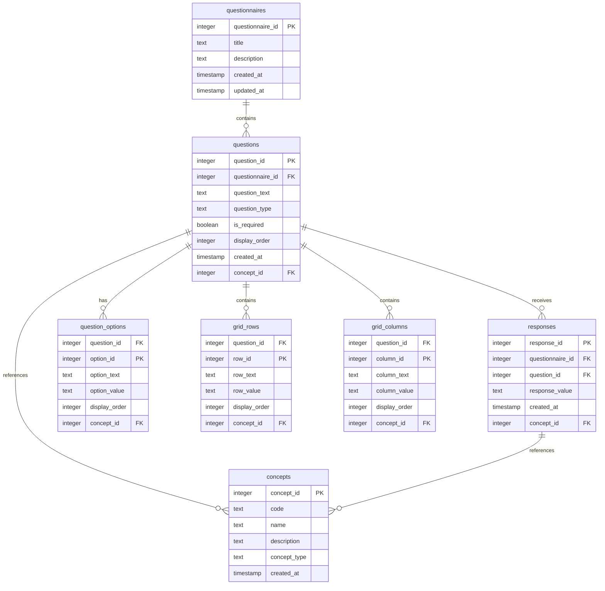

# QuestSQL

A SQL-first questionnaire development and administration system that unifies questionnaire design, data collection, and analysis through a single, well-structured data model.

## Vision

QuestSQL aims to revolutionize how health questionnaires are developed, administered, and analyzed by making SQL the foundation of everything. This approach provides several key benefits:

### SQL-First Design
- All questionnaire logic and relationships are encoded directly in SQL
- Questionnaire development happens through SQL DDL statements
- Enables multiple layers of abstraction:
  - REST APIs for DDL operations
  - SDKs for simplified interaction
  - Human-readable markdown language for questionnaire authoring

### Unified Data Model
- Single source of truth for questionnaire structure and data
- Eliminates the need for separate data dictionaries
- Enforces data quality and consistency through database constraints
- Supports both questionnaire development and data collection

### Client-Side Administration
- Lightweight SQLite-based UI for survey administration
- Direct interaction with the data model
- Real-time response collection and storage
- No complex middleware required

### Analytics Toolkit
- DuckDB-powered analysis capabilities
- Support for arbitrary questionnaire analysis
- Extensible API for community contributions
- SDKs for R, Python, and other languages

## System Architecture



## Progressive Implementation

### 1. Basic Model

The simplest implementation supports three core question types: true/false, multiple choice, and text.



#### Basic Schema
```sql
CREATE TABLE questionnaires (
    questionnaire_id INTEGER PRIMARY KEY,
    title TEXT NOT NULL,
    description TEXT,
    created_at TIMESTAMP DEFAULT CURRENT_TIMESTAMP
);

CREATE TABLE questions (
    question_id INTEGER PRIMARY KEY,
    questionnaire_id INTEGER REFERENCES questionnaires(questionnaire_id),
    question_text TEXT NOT NULL,
    question_type TEXT NOT NULL CHECK (question_type IN ('true_false', 'multiple_choice', 'text')),
    is_required BOOLEAN DEFAULT false,
    display_order INTEGER NOT NULL,
    created_at TIMESTAMP DEFAULT CURRENT_TIMESTAMP
);

CREATE TABLE question_options (
    option_id INTEGER PRIMARY KEY,
    question_id INTEGER REFERENCES questions(question_id),
    option_text TEXT NOT NULL,
    option_value TEXT NOT NULL,
    display_order INTEGER NOT NULL,
    created_at TIMESTAMP DEFAULT CURRENT_TIMESTAMP
);

CREATE TABLE responses (
    response_id INTEGER PRIMARY KEY,
    questionnaire_id INTEGER REFERENCES questionnaires(questionnaire_id),
    question_id INTEGER REFERENCES questions(question_id),
    response_value TEXT NOT NULL,
    created_at TIMESTAMP DEFAULT CURRENT_TIMESTAMP
);
```

### 2. Adding Select-All Questions

The next level adds support for select-all-that-apply questions by introducing a separate table for multiple selections.

```mermaid
erDiagram
    questionnaires {
        int questionnaire_id PK
        string title
        string description
        datetime created_at
    }
    questions {
        int question_id PK
        int questionnaire_id FK
        string question_text
        string question_type
        boolean is_required
        int display_order
        datetime created_at
    }
    question_options {
        int option_id PK
        int question_id FK
        string option_text
        string option_value
        int display_order
        datetime created_at
    }
    responses {
        int response_id PK
        int questionnaire_id FK
        int question_id FK
        string response_value
        datetime created_at
    }
    select_all_responses {
        int response_id PK
        int question_id FK
        string option_value
        datetime created_at
    }

    questionnaires ||--o{ questions : "questionnaire_id"
    questions ||--o{ question_options : "question_id"
    questions ||--o{ responses : "question_id"
    questions ||--o{ select_all_responses : "question_id"
    questionnaires ||--o{ responses : "questionnaire_id"
```



#### Extended Schema
```sql
-- Add select-all responses table
CREATE TABLE select_all_responses (
    response_id INTEGER PRIMARY KEY,
    question_id INTEGER REFERENCES questions(question_id),
    option_value TEXT NOT NULL,
    created_at TIMESTAMP DEFAULT CURRENT_TIMESTAMP
);

-- Update question type constraint
ALTER TABLE questions
    DROP CONSTRAINT valid_question_type;

ALTER TABLE questions
    ADD CONSTRAINT valid_question_type
    CHECK (question_type IN (
        'true_false',
        'multiple_choice',
        'select_all',
        'text'
    ));
```

### 3. Adding Grid Questions

The next level adds support for grid questions with rows and columns.



#### Extended Schema
```sql
-- Add grid columns table
CREATE TABLE grid_columns (
    column_id INTEGER PRIMARY KEY,
    question_id INTEGER REFERENCES questions(question_id),
    column_text TEXT NOT NULL,
    column_value TEXT NOT NULL,
    display_order INTEGER NOT NULL,
    created_at TIMESTAMP DEFAULT CURRENT_TIMESTAMP
);

-- Update question type constraint
ALTER TABLE questions
    DROP CONSTRAINT valid_question_type;

ALTER TABLE questions
    ADD CONSTRAINT valid_question_type
    CHECK (question_type IN (
        'true_false',
        'multiple_choice',
        'select_all',
        'grid',
        'grid_row',
        'text'
    ));
```

### 4. Adding Loop Questions

The final level adds support for repeating sections through loop questions.



#### Extended Schema
```sql
-- Add loop instance to responses
ALTER TABLE responses
    ADD COLUMN loop_instance INTEGER;

-- Update question type constraint
ALTER TABLE questions
    DROP CONSTRAINT valid_question_type;

ALTER TABLE questions
    ADD CONSTRAINT valid_question_type
    CHECK (question_type IN (
        'true_false',
        'multiple_choice',
        'select_all',
        'grid',
        'grid_row',
        'loop',
        'text'
    ));
```

## Implementation Examples

[Previous implementation examples remain the same, but organized by complexity level]

## Validation and Constraints

[Previous validation section remains the same]

## Analytics and Export

[Previous analytics section remains the same]

## Getting Started

[Coming soon]

## Contributing

[Coming soon]

## License

[Coming soon]

## Core Data Model

The foundation of QuestSQL is its core data model, which consists of four essential tables:



This core model supports:
1. Basic questionnaire structure
2. Multiple question types
3. Response collection
4. Grid-based questions
5. Standardized medical concepts

### Concept Mapping

The model uses concept mapping similar to OMOP CDM:

1. **Question Concepts**
   - Each question can map to a standard clinical concept
   - Example: A question about "Blood Pressure" maps to concept_id 3004249
   - This enables standardized question interpretation

2. **Response Concepts**
   - Each response can map to a standard clinical value
   - Example: A response of "High" to a blood pressure question maps to concept_id 4171373
   - This enables standardized response interpretation

3. **Option Concepts**
   - Multiple choice options can map to standard values
   - Example: "Yes" maps to concept_id 4188539
   - This ensures consistent value representation

4. **Grid Concepts**
   - Grid rows and columns can map to standard concepts
   - Example: A row for "Systolic" maps to concept_id 3004249
   - This enables structured data collection

### OMOP CDM Compatibility

QuestSQL's concept mapping aligns directly with OMOP CDM's design principles:

1. **Direct Mapping to OMOP**
   - Questions map to OMOP Concepts (CONCEPT table)
   - Responses map to OMOP Values (CONCEPT table)
   - Grid elements map to OMOP Measurements (MEASUREMENT table)
   - All mappings use standard OMOP concept IDs

2. **Observation Structure**
   - Questions become OMOP Observations
   - Responses become OMOP Values
   - Grid questions map to OMOP Measurements
   - Maintains temporal relationships

3. **Vocabulary Integration**
   - Uses OMOP's standard vocabularies
   - Supports SNOMED CT, LOINC, RxNorm, etc.
   - Enables cross-vocabulary mapping
   - Maintains concept hierarchies

4. **Data Quality**
   - Enforces standard concept usage
   - Validates against OMOP vocabularies
   - Maintains data consistency
   - Supports quality checks

### OMOP Mapping Support

QuestSQL provides comprehensive support for mapping questionnaire elements to specific OMOP CDM domains and vocabularies:

1. **Domain-Specific Mapping**
   - **Condition/Disease Questions**
     ```sql
     -- Example: Diabetes screening question
     INSERT INTO questions (
         questionnaire_id,
         question_text,
         question_type,
         concept_id,
         domain_id
     ) VALUES (
         1,
         'Have you been diagnosed with diabetes?',
         'multiple_choice',
         201820,  -- Diabetes mellitus concept
         'Condition'
     );
     ```

   - **Measurement Questions**
     ```sql
     -- Example: Blood pressure measurement
     INSERT INTO questions (
         questionnaire_id,
         question_text,
         question_type,
         concept_id,
         domain_id
     ) VALUES (
         1,
         'What is your blood pressure?',
         'grid',
         3004249,  -- Blood pressure concept
         'Measurement'
     );
     ```

   - **Drug/Medication Questions**
     ```sql
     -- Example: Medication adherence
     INSERT INTO questions (
         questionnaire_id,
         question_text,
         question_type,
         concept_id,
         domain_id
     ) VALUES (
         1,
         'Are you taking your prescribed medications?',
         'multiple_choice',
         4023213,  -- Medication adherence concept
         'Drug'
     );
     ```

2. **Vocabulary-Specific Development**
   - **SNOMED CT Questions**
     ```sql
     -- Example: Pain assessment using SNOMED
     INSERT INTO questions (
         questionnaire_id,
         question_text,
         question_type,
         concept_id,
         vocabulary_id
     ) VALUES (
         1,
         'Rate your pain level',
         'grid',
         36714913,  -- Pain severity concept
         'SNOMED'
     );
     ```

   - **LOINC Questions**
     ```sql
     -- Example: Lab result questions
     INSERT INTO questions (
         questionnaire_id,
         question_text,
         question_type,
         concept_id,
         vocabulary_id
     ) VALUES (
         1,
         'What was your last HbA1c result?',
         'numeric',
         3004410,  -- HbA1c concept
         'LOINC'
     );
     ```

   - **RxNorm Questions**
     ```sql
     -- Example: Medication questions
     INSERT INTO questions (
         questionnaire_id,
         question_text,
         question_type,
         concept_id,
         vocabulary_id
     ) VALUES (
         1,
         'Are you taking metformin?',
         'true_false',
         1502809,  -- Metformin concept
         'RxNorm'
     );
     ```

3. **Cross-Domain Mapping**
   ```sql
   -- Example: Complex health assessment
   INSERT INTO questions (
       questionnaire_id,
       question_text,
       question_type,
       concept_id,
       domain_id,
       parent_concept_id
   ) VALUES (
       1,
       'Complete the following health assessment',
       'grid',
       42539022,  -- Health assessment concept
       'Observation',
       42539022   -- Parent concept for assessment
   );

   -- Add assessment components
   INSERT INTO grid_rows (question_id, row_text, concept_id, domain_id) VALUES
   (1, 'Blood Pressure', 3004249, 'Measurement'),
   (1, 'Diabetes Status', 201820, 'Condition'),
   (1, 'Medication Adherence', 4023213, 'Drug');
   ```

4. **Temporal Mapping**
   ```sql
   -- Example: Longitudinal assessment
   INSERT INTO questions (
       questionnaire_id,
       question_text,
       question_type,
       concept_id,
       domain_id,
       temporal_type
   ) VALUES (
       1,
       'When did you first experience symptoms?',
       'datetime',
       44814650,  -- Symptom onset concept
       'Observation',
       'Event'
   );
   ```

5. **Value Set Support**
   ```sql
   -- Example: Standardized response options
   INSERT INTO question_options (
       question_id,
       option_text,
       option_value,
       concept_id,
       value_set_id
   ) VALUES 
   (1, 'Never', 'never', 4135376, 'Frequency'),
   (1, 'Sometimes', 'sometimes', 4135377, 'Frequency'),
   (1, 'Often', 'often', 4135378, 'Frequency'),
   (1, 'Always', 'always', 4135379, 'Frequency');
   ```

This mapping support enables:
- Precise alignment with OMOP CDM domains
- Standardized vocabulary usage
- Consistent data representation
- Seamless integration with clinical systems
- Support for complex health assessments
- Longitudinal data collection

### Benefits of Concept Mapping

The concept mapping approach provides several key advantages:

1. **Clinical Standardization**
   - Questions map to standard clinical concepts
   - Responses use standard clinical values
   - Enables consistent clinical interpretation
   - Supports clinical decision support

2. **Data Integration**
   - Seamless integration with clinical systems
   - Compatible with EHR data
   - Supports research data warehouses
   - Enables cross-system analysis

3. **Semantic Interoperability**
   - Standardized clinical terminology
   - Consistent value representation
   - Cross-vocabulary mapping
   - Semantic search capabilities

4. **Analytical Power**
   - Standardized analysis across systems
   - Support for clinical analytics
   - Population health insights
   - Research study integration

5. **Quality Assurance**
   - Built-in validation
   - Standard concept checking
   - Data consistency enforcement
   - Quality metrics support

6. **Future-Proofing**
   - Adaptable to new vocabularies
   - Support for emerging standards
   - Extensible concept mapping
   - Long-term maintainability

### Example Usage

```sql
-- Create a blood pressure question
INSERT INTO questions (
    questionnaire_id,
    question_text,
    question_type,
    concept_id
) VALUES (
    1,
    'What is your blood pressure?',
    'grid',
    3004249  -- Blood Pressure concept
);

-- Create grid rows with concepts
INSERT INTO grid_rows (question_id, row_text, row_value, concept_id) VALUES
(1, 'Systolic', 'systolic', 3004249),  -- Blood Pressure
(1, 'Diastolic', 'diastolic', 3004250); -- Diastolic Blood Pressure

-- Create grid columns with concepts
INSERT INTO grid_columns (question_id, column_text, column_value, concept_id) VALUES
(1, 'High', 'high', 4171373),    -- High
(1, 'Normal', 'normal', 4171374), -- Normal
(1, 'Low', 'low', 4171375);       -- Low

-- Record a response with concept mapping
INSERT INTO responses (
    questionnaire_id,
    question_id,
    response_value,
    concept_id
) VALUES (
    1,
    1,
    'high',
    4171373  -- High concept
);
```

This approach provides several benefits:
1. **Standardization**: All data points map to standard clinical concepts
2. **Interoperability**: Easy integration with OMOP CDM and other clinical systems
3. **Consistency**: Uniform representation of clinical concepts
4. **Analysis**: Enables standardized analysis across different questionnaires