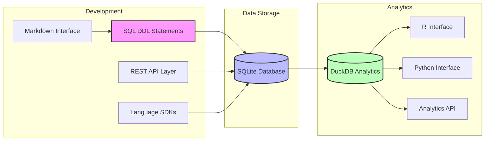
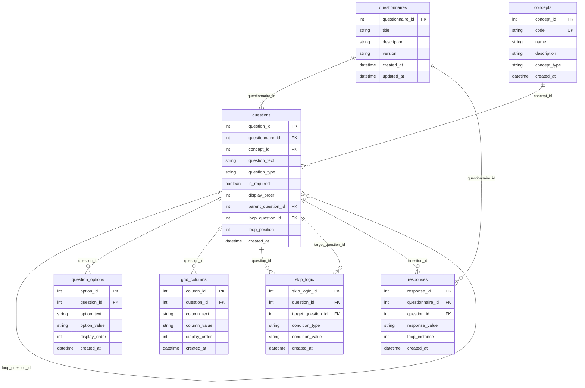

# QuestSQL

A SQL-first questionnaire development and administration system that unifies questionnaire design, data collection, and analysis through a single, well-structured data model.

## Vision

QuestSQL aims to revolutionize how health questionnaires are developed, administered, and analyzed by making SQL the foundation of everything. This approach provides several key benefits:

### SQL-First Design
- All questionnaire logic and relationships are encoded directly in SQL
- Questionnaire development happens through SQL DDL statements
- Enables multiple layers of abstraction:
  - REST APIs for DDL operations
  - SDKs for simplified interaction
  - Human-readable markdown language for questionnaire authoring

### Unified Data Model
- Single source of truth for questionnaire structure and data
- Eliminates the need for separate data dictionaries
- Enforces data quality and consistency through database constraints
- Supports both questionnaire development and data collection

### Client-Side Administration
- Lightweight SQLite-based UI for survey administration
- Direct interaction with the data model
- Real-time response collection and storage
- No complex middleware required

### Analytics Toolkit
- DuckDB-powered analysis capabilities
- Support for arbitrary questionnaire analysis
- Extensible API for community contributions
- SDKs for R, Python, and other languages

## End-to-End Pipeline



The pipeline shows how QuestSQL integrates different components:

1. **Development Layer**
   - SQL DDL statements as the primary development tool
   - Optional REST API for DDL operations
   - Language SDKs for simplified interaction
   - Markdown interface for human-readable questionnaire definition

2. **Data Storage**
   - SQLite database as the core storage
   - Stores both questionnaire structure and responses
   - Enables offline-first operation

3. **Analytics Layer**
   - DuckDB as the core analytics engine
   - Direct interfaces for R and Python
   - REST API for external analysis tools

## Core Principles

1. **Simplicity First**
   - Minimal dependencies
   - Clear, straightforward data model
   - Easy to understand and extend

2. **Quality by Design**
   - Built-in constraints for data quality
   - Enforced best practices
   - Standardized questionnaire structure

3. **Extensibility**
   - Flexible enough for various study needs
   - Community-driven development
   - Multiple abstraction layers

4. **Integration**
   - Unified development and administration
   - Seamless analysis capabilities
   - No separate documentation needed

## Data Model

The schema is designed to support all aspects of questionnaire lifecycle:



## Question Types and Implementation

QuestSQL supports a wide range of question types through its flexible data model. Here's how each type is implemented:

### 1. True/False Questions
Simple yes/no questions that require a boolean response.

```sql
-- Create a true/false question
INSERT INTO questions (
    questionnaire_id,
    question_text,
    question_type,
    is_required,
    display_order
) VALUES (
    1,
    'Have you experienced any chest pain in the last 24 hours?',
    'true_false',
    true,
    1
);
```

### 2. Multiple Choice Questions
Single-selection questions with predefined options.

```sql
-- Create a multiple choice question
INSERT INTO questions (
    questionnaire_id,
    question_text,
    question_type,
    is_required,
    display_order
) VALUES (
    1,
    'What is your current pain level?',
    'multiple_choice',
    true,
    2
);

-- Add options for the multiple choice question
INSERT INTO question_options (
    question_id,
    option_text,
    option_value,
    display_order
) VALUES 
    (2, 'No pain', '0', 1),
    (2, 'Mild pain', '1', 2),
    (2, 'Moderate pain', '2', 3),
    (2, 'Severe pain', '3', 4);
```

### 3. Select-All-That-Apply
Multiple selection questions where respondents can choose multiple options.

```sql
-- Create a select-all-that-apply question
INSERT INTO questions (
    questionnaire_id,
    question_text,
    question_type,
    is_required,
    display_order
) VALUES (
    1,
    'Which symptoms have you experienced? (Select all that apply)',
    'select_all',
    false,
    3
);

-- Add options for the select-all question
INSERT INTO question_options (
    question_id,
    option_text,
    option_value,
    display_order
) VALUES 
    (3, 'Headache', 'headache', 1),
    (3, 'Nausea', 'nausea', 2),
    (3, 'Fatigue', 'fatigue', 3),
    (3, 'Dizziness', 'dizziness', 4);
```

### 4. Grid Questions
Matrix-style questions with rows and columns.

```sql
-- Create a grid question
INSERT INTO questions (
    questionnaire_id,
    question_text,
    question_type,
    is_required,
    display_order
) VALUES (
    1,
    'Rate your symptoms on a scale of 1-5',
    'grid',
    true,
    4
);

-- Add grid columns (rating scale)
INSERT INTO grid_columns (
    question_id,
    column_text,
    column_value,
    display_order
) VALUES 
    (4, '1', '1', 1),
    (4, '2', '2', 2),
    (4, '3', '3', 3),
    (4, '4', '4', 4),
    (4, '5', '5', 5);

-- Add grid rows (symptoms)
INSERT INTO questions (
    questionnaire_id,
    question_text,
    question_type,
    is_required,
    display_order,
    parent_question_id
) VALUES 
    (1, 'Pain', 'grid_row', true, 1, 4),
    (1, 'Fatigue', 'grid_row', true, 2, 4),
    (1, 'Sleep quality', 'grid_row', true, 3, 4);
```

### 5. Loop Questions
Repeating sections of questions.

```sql
-- Create a loop question (parent)
INSERT INTO questions (
    questionnaire_id,
    question_text,
    question_type,
    is_required,
    display_order
) VALUES (
    1,
    'List your medications',
    'loop',
    false,
    5
);

-- Add looped questions
INSERT INTO questions (
    questionnaire_id,
    question_text,
    question_type,
    is_required,
    display_order,
    loop_question_id,
    loop_position
) VALUES 
    (1, 'Medication name', 'text', true, 1, 5, 1),
    (1, 'Dosage', 'text', true, 2, 5, 2),
    (1, 'Frequency', 'text', true, 3, 5, 3);
```

### 6. Skip Logic
Conditional question display based on previous answers.

```sql
-- Add skip logic
INSERT INTO skip_logic (
    question_id,
    target_question_id,
    condition_type,
    condition_value
) VALUES (
    2,  -- Source question (pain level)
    4,  -- Target question (grid question)
    'equals',
    '3'  -- Skip to grid if pain is severe
);
```

### Response Storage
All responses are stored in a unified format in the `responses` table:

```sql
-- Example responses
INSERT INTO responses (
    questionnaire_id,
    question_id,
    response_value,
    loop_instance
) VALUES 
    (1, 1, 'true', NULL),                    -- True/False response
    (1, 2, '2', NULL),                       -- Multiple choice response
    (1, 3, 'headache,nausea', NULL),         -- Select-all response (comma-separated)
    (1, 4, '3', NULL),                       -- Grid response
    (1, 5, '1', NULL),                       -- Loop question response
    (1, 6, 'Aspirin', 1),                    -- First loop instance
    (1, 7, '100mg', 1),
    (1, 8, 'Twice daily', 1),
    (1, 6, 'Ibuprofen', 2),                  -- Second loop instance
    (1, 7, '200mg', 2),
    (1, 8, 'Three times daily', 2);
```

## Validation Rules and Constraints

QuestSQL implements multiple layers of validation to ensure data quality and integrity:

### 1. Database Constraints

```sql
-- Primary and Foreign Key Constraints
ALTER TABLE questions
    ADD CONSTRAINT fk_questionnaire
    FOREIGN KEY (questionnaire_id)
    REFERENCES questionnaires(questionnaire_id)
    ON DELETE CASCADE;

ALTER TABLE question_options
    ADD CONSTRAINT fk_question
    FOREIGN KEY (question_id)
    REFERENCES questions(question_id)
    ON DELETE CASCADE;

-- Unique Constraints
ALTER TABLE concepts
    ADD CONSTRAINT unique_concept_code
    UNIQUE (code);

-- Check Constraints for Question Types
ALTER TABLE questions
    ADD CONSTRAINT valid_question_type
    CHECK (question_type IN (
        'true_false',
        'multiple_choice',
        'select_all',
        'grid',
        'grid_row',
        'loop',
        'text',
        'number',
        'date'
    ));

-- Check Constraints for Response Values
ALTER TABLE responses
    ADD CONSTRAINT valid_true_false_response
    CHECK (
        (SELECT question_type FROM questions WHERE question_id = responses.question_id) != 'true_false'
        OR response_value IN ('true', 'false')
    );

ALTER TABLE responses
    ADD CONSTRAINT valid_multiple_choice_response
    CHECK (
        (SELECT question_type FROM questions WHERE question_id = responses.question_id) != 'multiple_choice'
        OR response_value IN (
            SELECT option_value 
            FROM question_options 
            WHERE question_id = responses.question_id
        )
    );
```

### 2. Business Logic Validations

```sql
-- Function to validate select-all responses
CREATE OR REPLACE FUNCTION validate_select_all_response(
    p_question_id INTEGER,
    p_response_value TEXT
) RETURNS BOOLEAN AS $$
BEGIN
    -- Split response into array and validate each value
    RETURN (
        SELECT bool_and(option_value = ANY(string_to_array(p_response_value, ',')))
        FROM question_options
        WHERE question_id = p_question_id
    );
END;
$$ LANGUAGE plpgsql;

-- Function to validate grid responses
CREATE OR REPLACE FUNCTION validate_grid_response(
    p_question_id INTEGER,
    p_response_value TEXT
) RETURNS BOOLEAN AS $$
BEGIN
    -- Check if response is within grid column range
    RETURN p_response_value IN (
        SELECT column_value
        FROM grid_columns
        WHERE question_id = p_question_id
    );
END;
$$ LANGUAGE plpgsql;

-- Trigger to enforce loop question constraints
CREATE OR REPLACE FUNCTION validate_loop_question()
RETURNS TRIGGER AS $$
BEGIN
    -- Ensure loop_instance is not null for loop questions
    IF EXISTS (
        SELECT 1 FROM questions
        WHERE question_id = NEW.question_id
        AND question_type = 'loop'
    ) AND NEW.loop_instance IS NULL THEN
        RAISE EXCEPTION 'Loop instance required for loop questions';
    END IF;
    RETURN NEW;
END;
$$ LANGUAGE plpgsql;

CREATE TRIGGER enforce_loop_question
    BEFORE INSERT OR UPDATE ON responses
    FOR EACH ROW
    EXECUTE FUNCTION validate_loop_question();
```

### 3. Data Quality Rules

```sql
-- View to identify missing required responses
CREATE VIEW missing_required_responses AS
SELECT 
    q.questionnaire_id,
    q.question_id,
    q.question_text,
    q.is_required
FROM questions q
LEFT JOIN responses r ON q.question_id = r.question_id
WHERE q.is_required = true
AND r.response_id IS NULL;

-- View to identify invalid responses by question type
CREATE VIEW invalid_responses AS
SELECT 
    r.response_id,
    q.question_id,
    q.question_text,
    q.question_type,
    r.response_value
FROM responses r
JOIN questions q ON r.question_id = q.question_id
WHERE 
    (q.question_type = 'true_false' AND r.response_value NOT IN ('true', 'false'))
    OR (q.question_type = 'multiple_choice' AND r.response_value NOT IN (
        SELECT option_value FROM question_options WHERE question_id = q.question_id
    ))
    OR (q.question_type = 'select_all' AND NOT validate_select_all_response(q.question_id, r.response_value))
    OR (q.question_type = 'grid' AND NOT validate_grid_response(q.question_id, r.response_value));
```

### 4. Skip Logic Validation

```sql
-- Function to validate skip logic conditions
CREATE OR REPLACE FUNCTION validate_skip_logic(
    p_question_id INTEGER,
    p_response_value TEXT
) RETURNS TABLE (
    target_question_id INTEGER,
    should_skip BOOLEAN
) AS $$
BEGIN
    RETURN QUERY
    SELECT 
        sl.target_question_id,
        CASE 
            WHEN sl.condition_type = 'equals' THEN p_response_value = sl.condition_value
            WHEN sl.condition_type = 'not_equals' THEN p_response_value != sl.condition_value
            WHEN sl.condition_type = 'greater_than' THEN p_response_value::numeric > sl.condition_value::numeric
            WHEN sl.condition_type = 'less_than' THEN p_response_value::numeric < sl.condition_value::numeric
            ELSE false
        END as should_skip
    FROM skip_logic sl
    WHERE sl.question_id = p_question_id;
END;
$$ LANGUAGE plpgsql;
```

These validation rules ensure:
1. Data integrity through foreign key constraints
2. Valid question types and response values
3. Proper handling of loop questions
4. Required field validation
5. Skip logic consistency
6. Data quality monitoring through views

## Validation in Practice

Here's how to use QuestSQL's validation system in real-world scenarios:

### 1. Validating Questionnaire Completion

```sql
-- Check if a questionnaire is complete
WITH required_questions AS (
    SELECT 
        q.question_id,
        q.question_text,
        COUNT(r.response_id) as response_count
    FROM questions q
    LEFT JOIN responses r ON q.question_id = r.question_id
    WHERE q.is_required = true
    AND q.questionnaire_id = 1
    GROUP BY q.question_id, q.question_text
)
SELECT 
    CASE 
        WHEN bool_and(response_count > 0) THEN 'Complete'
        ELSE 'Incomplete'
    END as completion_status,
    COUNT(*) as total_required_questions,
    SUM(response_count) as answered_questions
FROM required_questions;
```

### 2. Data Quality Monitoring

```sql
-- Monitor data quality for a specific questionnaire
SELECT 
    q.question_type,
    COUNT(*) as total_questions,
    COUNT(r.response_id) as total_responses,
    COUNT(CASE WHEN r.response_id IS NULL AND q.is_required THEN 1 END) as missing_required,
    COUNT(CASE WHEN r.response_id IS NOT NULL THEN 1 END) as valid_responses
FROM questions q
LEFT JOIN responses r ON q.question_id = r.question_id
WHERE q.questionnaire_id = 1
GROUP BY q.question_type;

-- Check for invalid responses
SELECT 
    q.question_text,
    q.question_type,
    r.response_value,
    CASE 
        WHEN q.question_type = 'true_false' AND r.response_value NOT IN ('true', 'false') THEN 'Invalid boolean'
        WHEN q.question_type = 'multiple_choice' AND r.response_value NOT IN (
            SELECT option_value FROM question_options WHERE question_id = q.question_id
        ) THEN 'Invalid option'
        WHEN q.question_type = 'select_all' AND NOT validate_select_all_response(q.question_id, r.response_value) 
        THEN 'Invalid selection'
        WHEN q.question_type = 'grid' AND NOT validate_grid_response(q.question_id, r.response_value) 
        THEN 'Invalid grid value'
    END as validation_error
FROM responses r
JOIN questions q ON r.question_id = q.question_id
WHERE q.questionnaire_id = 1
AND (
    (q.question_type = 'true_false' AND r.response_value NOT IN ('true', 'false'))
    OR (q.question_type = 'multiple_choice' AND r.response_value NOT IN (
        SELECT option_value FROM question_options WHERE question_id = q.question_id
    ))
    OR (q.question_type = 'select_all' AND NOT validate_select_all_response(q.question_id, r.response_value))
    OR (q.question_type = 'grid' AND NOT validate_grid_response(q.question_id, r.response_value))
);
```

### 3. Skip Logic Implementation

```sql
-- Function to determine next question based on skip logic
CREATE OR REPLACE FUNCTION get_next_question(
    p_questionnaire_id INTEGER,
    p_current_question_id INTEGER,
    p_response_value TEXT
) RETURNS INTEGER AS $$
DECLARE
    v_next_question_id INTEGER;
BEGIN
    -- Check skip logic
    SELECT target_question_id INTO v_next_question_id
    FROM validate_skip_logic(p_current_question_id, p_response_value)
    WHERE should_skip = true
    LIMIT 1;

    -- If no skip logic applies, get next question in order
    IF v_next_question_id IS NULL THEN
        SELECT question_id INTO v_next_question_id
        FROM questions
        WHERE questionnaire_id = p_questionnaire_id
        AND display_order > (
            SELECT display_order 
            FROM questions 
            WHERE question_id = p_current_question_id
        )
        ORDER BY display_order
        LIMIT 1;
    END IF;

    RETURN v_next_question_id;
END;
$$ LANGUAGE plpgsql;

-- Example usage in a survey flow
WITH question_flow AS (
    SELECT 
        q.question_id,
        q.question_text,
        r.response_value,
        get_next_question(1, q.question_id, r.response_value) as next_question_id
    FROM questions q
    LEFT JOIN responses r ON q.question_id = r.question_id
    WHERE q.questionnaire_id = 1
    ORDER BY q.display_order
)
SELECT 
    question_text,
    response_value,
    (SELECT question_text FROM questions WHERE question_id = next_question_id) as next_question
FROM question_flow;
```

### 4. Loop Question Validation

```sql
-- Validate loop question completeness
WITH loop_instances AS (
    SELECT DISTINCT loop_instance
    FROM responses
    WHERE question_id IN (
        SELECT question_id 
        FROM questions 
        WHERE loop_question_id IS NOT NULL
    )
    AND questionnaire_id = 1
)
SELECT 
    q.question_text,
    li.loop_instance,
    COUNT(r.response_id) as answered_questions,
    COUNT(DISTINCT q.question_id) as required_questions,
    CASE 
        WHEN COUNT(r.response_id) = COUNT(DISTINCT q.question_id) THEN 'Complete'
        ELSE 'Incomplete'
    END as instance_status
FROM loop_instances li
CROSS JOIN questions q
LEFT JOIN responses r ON q.question_id = r.question_id 
    AND r.loop_instance = li.loop_instance
WHERE q.loop_question_id IS NOT NULL
AND q.questionnaire_id = 1
GROUP BY q.question_text, li.loop_instance
ORDER BY li.loop_instance;
```

### 5. Response Validation Before Insert

```sql
-- Function to validate and insert a response
CREATE OR REPLACE FUNCTION insert_validated_response(
    p_questionnaire_id INTEGER,
    p_question_id INTEGER,
    p_response_value TEXT,
    p_loop_instance INTEGER DEFAULT NULL
) RETURNS INTEGER AS $$
DECLARE
    v_question_type TEXT;
    v_is_valid BOOLEAN;
BEGIN
    -- Get question type
    SELECT question_type INTO v_question_type
    FROM questions
    WHERE question_id = p_question_id;

    -- Validate response based on question type
    v_is_valid := CASE
        WHEN v_question_type = 'true_false' THEN 
            p_response_value IN ('true', 'false')
        WHEN v_question_type = 'multiple_choice' THEN
            p_response_value IN (
                SELECT option_value 
                FROM question_options 
                WHERE question_id = p_question_id
            )
        WHEN v_question_type = 'select_all' THEN
            validate_select_all_response(p_question_id, p_response_value)
        WHEN v_question_type = 'grid' THEN
            validate_grid_response(p_question_id, p_response_value)
        ELSE true
    END;

    -- Insert response if valid
    IF v_is_valid THEN
        INSERT INTO responses (
            questionnaire_id,
            question_id,
            response_value,
            loop_instance
        ) VALUES (
            p_questionnaire_id,
            p_question_id,
            p_response_value,
            p_loop_instance
        ) RETURNING response_id;
    ELSE
        RAISE EXCEPTION 'Invalid response value for question type %', v_question_type;
    END IF;
END;
$$ LANGUAGE plpgsql;

-- Example usage
SELECT insert_validated_response(1, 1, 'true', NULL);
SELECT insert_validated_response(1, 2, '2', NULL);
SELECT insert_validated_response(1, 3, 'headache,nausea', NULL);
```

These examples demonstrate how to:
1. Monitor questionnaire completion
2. Track data quality
3. Implement skip logic
4. Validate loop questions
5. Safely insert validated responses

## Simplified Core Implementation

QuestSQL can be implemented with a simpler approach, focusing on core features first. Here's how to build the essential functionality:

### 1. Core Schema

```sql
-- Simplified schema focusing on essential features
CREATE TABLE questionnaires (
    questionnaire_id INTEGER PRIMARY KEY,
    title TEXT NOT NULL,
    description TEXT,
    version TEXT,
    created_at TIMESTAMP DEFAULT CURRENT_TIMESTAMP
);

CREATE TABLE questions (
    question_id INTEGER PRIMARY KEY,
    questionnaire_id INTEGER REFERENCES questionnaires(questionnaire_id),
    question_text TEXT NOT NULL,
    question_type TEXT NOT NULL CHECK (question_type IN ('true_false', 'multiple_choice', 'text')),
    is_required BOOLEAN DEFAULT false,
    display_order INTEGER NOT NULL,
    created_at TIMESTAMP DEFAULT CURRENT_TIMESTAMP
);

CREATE TABLE question_options (
    option_id INTEGER PRIMARY KEY,
    question_id INTEGER REFERENCES questions(question_id),
    option_text TEXT NOT NULL,
    option_value TEXT NOT NULL,
    display_order INTEGER NOT NULL,
    created_at TIMESTAMP DEFAULT CURRENT_TIMESTAMP
);

CREATE TABLE responses (
    response_id INTEGER PRIMARY KEY,
    questionnaire_id INTEGER REFERENCES questionnaires(questionnaire_id),
    question_id INTEGER REFERENCES questions(question_id),
    response_value TEXT NOT NULL,
    created_at TIMESTAMP DEFAULT CURRENT_TIMESTAMP
);

-- New table for select-all responses
CREATE TABLE select_all_responses (
    response_id INTEGER PRIMARY KEY,
    question_id INTEGER REFERENCES questions(question_id),
    option_value TEXT NOT NULL,
    created_at TIMESTAMP DEFAULT CURRENT_TIMESTAMP
);
```

### 2. Basic Question Types

```sql
-- Create a simple questionnaire
INSERT INTO questionnaires (title, description) 
VALUES ('Basic Health Survey', 'A simple health questionnaire');

-- Add a true/false question
INSERT INTO questions (
    questionnaire_id,
    question_text,
    question_type,
    is_required,
    display_order
) VALUES (
    1,
    'Have you experienced chest pain in the last 24 hours?',
    'true_false',
    true,
    1
);

-- Add a multiple choice question
INSERT INTO questions (
    questionnaire_id,
    question_text,
    question_type,
    is_required,
    display_order
) VALUES (
    1,
    'What is your current pain level?',
    'multiple_choice',
    true,
    2
);

-- Add options for the multiple choice question
INSERT INTO question_options (
    question_id,
    option_text,
    option_value,
    display_order
) VALUES 
    (2, 'No pain', '0', 1),
    (2, 'Mild pain', '1', 2),
    (2, 'Moderate pain', '2', 3),
    (2, 'Severe pain', '3', 4);

-- Add a text question
INSERT INTO questions (
    questionnaire_id,
    question_text,
    question_type,
    is_required,
    display_order
) VALUES (
    1,
    'Please describe any other symptoms you are experiencing.',
    'text',
    false,
    3
);
```

### 3. Simple Response Collection

```sql
-- Function to insert a response with basic validation
CREATE OR REPLACE FUNCTION insert_response(
    p_questionnaire_id INTEGER,
    p_question_id INTEGER,
    p_response_value TEXT
) RETURNS INTEGER AS $$
DECLARE
    v_question_type TEXT;
BEGIN
    -- Get question type
    SELECT question_type INTO v_question_type
    FROM questions
    WHERE question_id = p_question_id;

    -- Basic validation
    IF v_question_type = 'true_false' AND p_response_value NOT IN ('true', 'false') THEN
        RAISE EXCEPTION 'Invalid response for true/false question';
    END IF;

    IF v_question_type = 'multiple_choice' AND p_response_value NOT IN (
        SELECT option_value 
        FROM question_options 
        WHERE question_id = p_question_id
    ) THEN
        RAISE EXCEPTION 'Invalid response for multiple choice question';
    END IF;

    -- Insert response
    RETURN (
        INSERT INTO responses (
            questionnaire_id,
            question_id,
            response_value
        ) VALUES (
            p_questionnaire_id,
            p_question_id,
            p_response_value
        ) RETURNING response_id
    );
END;
$$ LANGUAGE plpgsql;

-- Function to insert select-all responses
CREATE OR REPLACE FUNCTION insert_select_all_responses(
    p_question_id INTEGER,
    p_selected_options TEXT[]
) RETURNS INTEGER AS $$
DECLARE
    v_option TEXT;
BEGIN
    -- Validate all options
    FOREACH v_option IN ARRAY p_selected_options
    LOOP
        IF v_option NOT IN (
            SELECT option_value 
            FROM question_options 
            WHERE question_id = p_question_id
        ) THEN
            RAISE EXCEPTION 'Invalid option: %', v_option;
        END IF;
    END LOOP;

    -- Insert each selected option
    FOREACH v_option IN ARRAY p_selected_options
    LOOP
        INSERT INTO select_all_responses (question_id, option_value)
        VALUES (p_question_id, v_option);
    END LOOP;

    RETURN 1;
END;
$$ LANGUAGE plpgsql;

-- Example usage
SELECT insert_response(1, 1, 'true');
SELECT insert_response(1, 2, '2');
SELECT insert_select_all_responses(3, ARRAY['headache', 'nausea']);
SELECT insert_response(1, 4, 'Feeling tired and have a headache');
```

### 4. Basic Analysis

```sql
-- Get questionnaire completion status
SELECT 
    q.question_text,
    q.is_required,
    CASE 
        WHEN r.response_id IS NOT NULL THEN 'Answered'
        ELSE 'Not answered'
    END as status
FROM questions q
LEFT JOIN responses r ON q.question_id = r.question_id
WHERE q.questionnaire_id = 1
ORDER BY q.display_order;

-- Get response distribution for multiple choice questions
SELECT 
    q.question_text,
    qo.option_text,
    COUNT(r.response_id) as response_count
FROM questions q
JOIN question_options qo ON q.question_id = qo.question_id
LEFT JOIN responses r ON q.question_id = r.question_id 
    AND r.response_value = qo.option_value
WHERE q.questionnaire_id = 1
AND q.question_type = 'multiple_choice'
GROUP BY q.question_text, qo.option_text, qo.display_order
ORDER BY qo.display_order;
```

### 5. Simple Export

```sql
-- Export questionnaire responses to CSV format
SELECT 
    q.question_text,
    CASE 
        WHEN q.question_type = 'true_false' THEN r.response_value
        WHEN q.question_type = 'multiple_choice' THEN qo.option_text
        WHEN q.question_type = 'select_all' THEN (
            SELECT string_agg(qo2.option_text, ', ')
            FROM select_all_responses sar
            JOIN question_options qo2 ON sar.option_value = qo2.option_value
            WHERE sar.question_id = q.question_id
        )
        ELSE r.response_value
    END as response
FROM questions q
LEFT JOIN responses r ON q.question_id = r.question_id
LEFT JOIN question_options qo ON q.question_id = qo.question_id 
    AND r.response_value = qo.option_value
WHERE q.questionnaire_id = 1
ORDER BY q.display_order;
```